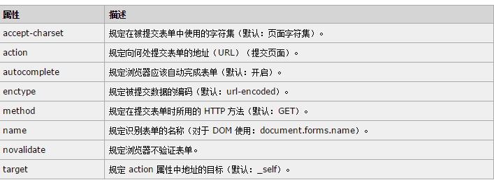
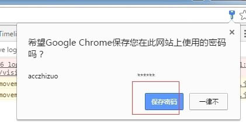
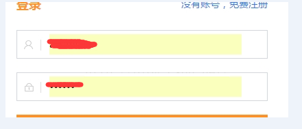
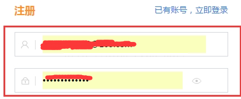
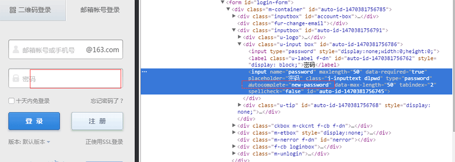

# `password input`浏览器自动填充密码

解决办法是在`form`上或`input`上添加`autoComplete="off"`这个属性。

`form`表单的属性如下所示：

但是这个解决方案在谷歌和火狐上均有 bug,下面来一个一个解决。

1. `autocomplete="off"`在`Chrome`中不起作用解决方案。

网站项目中，有登录和注册的弹框，在除`Chrome`的浏览器中一切都 ok，一旦在谷歌浏览器中，问题来了：

首先从登录弹框中登陆成功，`Chrome`会弹出是否保存密码的提示框，点击保存密码按钮，

然后接着退出账户，这时打开注册弹框，你会发现注册弹框中用户名和密码也被默认填写进去了（登录弹框中默认填写进去符合逻辑），

这现象就诡异了，开始各种查，cookie，本地缓存，等等，都解决不了这问题；查阅后，很多没有这个的解决方案。

1. 通常我们会在`form`表单上加入`autocomplete="off"`或者在输入框中加入`autocomplete="off"`。
2. 但是有一种情况例外，就是表单中有`input[type="password"]`，点击保存密码后，在`Chrome`浏览器则自动填充了用户名和密码的输入框；为了统一样式，我们需要就对`Chrome`的问题经行单独处理。

总结了 4 种解决方案，如下：

1. 修改`disabled`属性。
2. 去除输入框的`name`和`id`属性。
3. 可以在不需要默认填写的`input`框中设置`autocomplete="new-password"`。\
   网上咱没有找到对其详细解释，但是发现 163 邮箱的登录注册是这么用的，所以就借鉴借鉴咯，测试之后也是可以解决问题的，也是最简单的解决办法，网易给您点个赞！
   
4. 修改`readonly`属性。`<input type="password" readonly onfocus="this.removeAttribute('readonly');"/>`\
   但`Firefox`中有个 Bug。首次提交后，FF 会提示是否记住某某网站的密码，点击“记住”后，`input[type=text]`设置`autocomplete="off"`将不起作用。\
   有两种情况：
   1. form 中没有`input[type=password]`，`autocomplete="off"`将起作用
   2. 去掉 form，设置`input[type=text]`的`autocomplete`也起作用（测试不好用）
   3. Firefox 则需要使用另一个扩展属性`disableautocomplete`。`<input type="text"  disableautocomplete autocomplete="off"  id="number"/>`（测试也不行）
