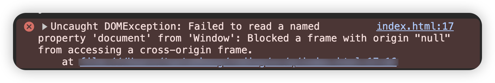

# `window.open`打开链接修改窗口标题

```js
let test = window.open("https://www.zhihu.com/");
setTimeout(() => {
  test.document.title = "修改标题";
}, 3000);
```

本来以为很简单，使用上面方法就能实现，但是发现会存在跨越问题，不能修改标题。



为解决跨域问题，可以借助`iframe`实现：

```js
openNewWindow("https://www.zhihu.com/", "修改标题");
function openNewWindow(url, title) {
  const test = window.open("about:blank");
  test.document.title = title;
  const iframe = document.createElement("iframe");
  iframe.src = url;
  iframe.style.width = "100%";
  iframe.style.height = "100vh";
  iframe.style.margin = "0";
  iframe.style.padding = "0";
  iframe.style.overflow = "hidden";
  iframe.style.border = "none";
  test.document.body.style.margin = "0";
  test.document.body.appendChild(iframe);
}
```
