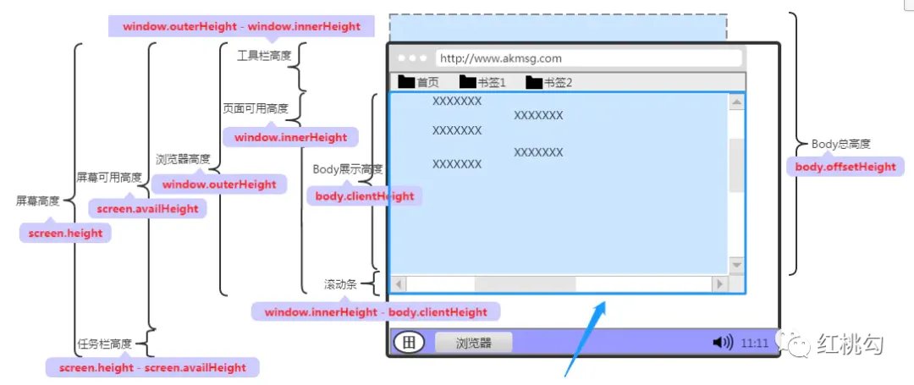
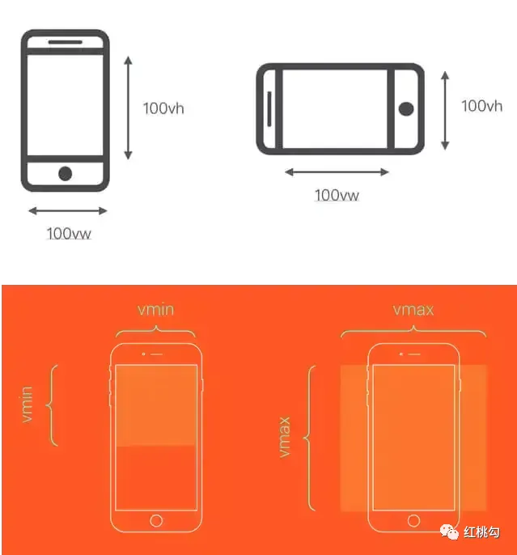
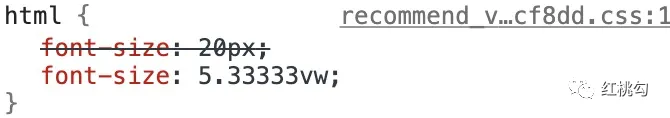
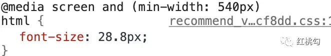
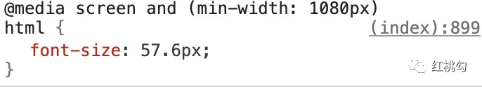
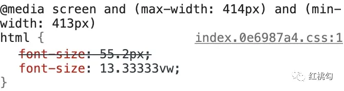
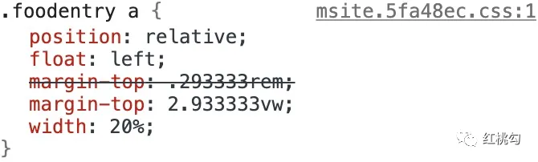

# 大厂是怎么做移动端适配的

## 前言

随着 Web 技术的革新，移动端适配方案也在不断的变化，网上有很多关于移动端适配的文章，说什么`rem`布局已经过时，`vw`适配才是最好的适配方案。有这种理解的同学是错误的，任何适配方案都有它的优缺点，要结合自己的使用场景来进行选择。

## 移动端适配的重新思考

### 移动端适配就是用 rem 或 vw？

并不是所有场景都适合用用`rem`或`vw`进行适配。

- `vw`和`rem`适配的本质是等比例缩放，让页面在不同屏幕尺寸下有类似于矢量图片缩放的效果，保证了页面元素之间的尺寸缩放比例和位置。
- 这两种适配方案适合视觉组件种类比较多，视觉设计对元素位置的相对关系依赖较强的移动端页面，基本上大部分页面都可以用这两种方案进行适配。
- 但对于文本内容较多，我们希望引导用户沉浸在更多的内容而不是更大的内容的，这种等比例缩放的方案并不能满足要求，推荐直接使用`px`结合`flex`等布局方式进行适配。

### rem 该抛弃了，使用 vw 不香么？

`vw`适配不是万能的，最好与`rem`配合使用。

- 当初之所以使用`rem`的方案流行开来正是因为在那时`viewport units`的浏览器支持程度不甚理想（IOS 8+, Android 4.4+ 参见 viewport units 的 caniuse）。而相比较之下`rem`就好多了（IOS 4.1+, Android 2.1+ 参见 caniuse），所以对于`vw`，在当时的大环境下前端想说爱你不容易。
- 随着前端技术的革新，最主要是各大浏览器厂商的给力，除 Opera Mini 全版本和 IE 低版本不支持之外，其他的浏览器基本上都已经支持`vw`了，开始有人或者有团队在探讨在实际项目中的使用。虽然大漠老师在《再聊移动端页面的适配》一文中提出的`vw`方案中使用`viewport-units-buggyfill`库进行兼容的做法，我个人更是不建议，由于这个库使用`css content`属性进行兼容处理，官方文档中就指出了对部分浏览器的`img标签`有影响 ，需要全局引入一条`css`规则。且对于需要正常使用`content`的情况（如：图标字体）也会引起不可避免的冲突，另外也不支持伪元素的兼容。所以从我个人的角度来说，如果你一定要问我使用怎样的`vw`适配方案，我会推荐给你上述两种`vw + rem`的方案。
- 虽然采用`vw`适配后的页面效果很好，但是它是利用视口单位实现的布局，依赖视口大小而自动缩放，无论视口过大还是过小，它也随着视口过大或者过小，失去了最大最小宽度的限制。

## 移动端适配方案

### rem 适配

`rem`适配的本质是布局等比例的缩放，通过动态设置`html`的`font-size`来改变`rem`的大小。

**viewport 配置：**

```html
<!-- dpr = 1-->
<meta
  name="viewport"
  content="width=device-width; initial-scale=1; maximum-scale=1; minimum-scale=1; user-scalable=no;"
/>
```

上面把`scale`设置成固定 1 倍的视口的大小，也可以根据`dpr`的值缩放`viewport`，如下：

```js
//下面是根据设备dpr设置viewport
var dpr = window.devicePixelRatio || 1;
var scale = 1 / dpr;

viewport.setAttribute(
  "content",
  "width=device-width" +
    ",initial-scale=" +
    scale +
    ", maximum-scale=" +
    scale +
    ", minimum-scale=" +
    scale +
    ", user-scalable=no"
);
```

有几点要注意：

- `viewport`标签只对移动端浏览器有效，对`PC`端浏览器是无效的。
- 当缩放比例为`100%`时，`逻辑像素 = CSS 像素宽度 = 理想视口的宽度 = 布局视口的宽度`。
- 单独设置`initial-scale`或`width`都会有兼容性问题，所以设置布局视口为理想视口的最佳方法是同时设置这两个属性。
- 即使设置了`user-scalable = no`，在 Android Chrome 浏览器中也可以强制启用手动缩放。

**设置 rem 基准值：**

核心代码为如下：

```js
// set 1rem = 逻辑像素（设备独立像素） / 10
function setRemUnit() {
  var rem = document.documentElement.clientWidth / 10;
  // 375/10 = 37.5
  docEl.style.fontSize = rem + "px";
}
setRemUnit();
```

- 将`html`节点的`font-size`设置为页面 clientWidth(布局视口)的 1/10，即：`1rem = 布局视口的1/10`。
- 在 iphone6 下：`docEl.clientWidth`=设备独立像素（逻辑像素）= 布局视口宽度 = 理想窗口宽度 = 375。此时：`1rem = 375/10 + px = 37.5px`。

**postcss-pxtorem 将单位转化为 rem：**

```js
module.exports = {
  plugins: {
    autoprefixer: {
      browsers: ["Android >= 4.0", "iOS >= 7"],
    },
    "postcss-pxtorem": {
      rootValue: 37.5,
      propList: ["*", "!font-size"],
      selectorBlackList: ["van-circle__layer", "ignore"],
    },
  },
};
```

- `rootValue`是转换`px`的基准值，参考设备 iPhone6，设备宽度`375px`。规则：基准值=当前设备宽度的 1/10。
- 基准值设置代码中，在 iPhone6 设备设置的`html—&gt;font-size`也为`37.5px`。
- 但是设计稿尺寸`750px`大小，所以量取设计稿量尺寸的时候需要除以 2。

**rem 布局的缺点：**

在响应式布局中，必须通过 js 来动态控制根元素`font-size`的大小，也就是说`css样式`和`js代码`有一定的耦合性，且必须将改变`font-size`的代码放在`css`样式之前。

### vw 适配

`vw`是基于`Viewport`视窗的长度单位，这里的视窗（`Viewport`）指的就是浏览器可视化的区域，而这个可视区域是`window.innerWidth/window.innerHeight`的大小，用图简单的示意如下：



在 CSS Values and Units Module Level 3 中和 Viewport 相关的单位有四个，分别为`vw`、`vh`、`vmin`和`vmax`。

- `vw`：是 Viewport's width 的简写,`1vw`等于`window.innerWidth的1%`。
- `vh`：和`vw`类似，是 Viewport's height 的简写，`1vh`等于`window.innerHeihgt的1%`。
- `vmin`：`vmin`的值是当前`vw`和`vh`中较小的值。
- `vmax`：`vmax`的值是当前`vw`和`vh`中较大的值。



如果设计稿使用`750px`宽度，则`100vw = 750px`，即`1vw = 7.5px`。那么我们可以根据设计图上的`px`值直接转换成对应的`vw`值。如果不想自己计算，我们可以使用`PostCSS`的插件`postcss-px-to-viewport`，让我们可以直接在代码中写`px`。

```js
{
  loader: 'postcss-loader',
  options: {
    plugins: ()=>[
      require('autoprefixer')({
        browsers: ['last 5 versions']
      }),
      require('postcss-px-to-viewport')({
        viewportWidth: 375, //视口宽度（数字)
        viewportHeight: 1334, //视口高度（数字）
        unitPrecision: 3, //设置的保留小数位数（数字）
        viewportUnit: 'vw', //设置要转换的单位（字符串）
        selectorBlackList: ['.ignore', '.hairlines'], //不需要进行转换的类名（数组）
        minPixelValue: 1, //设置要替换的最小像素值（数字）
        mediaQuery: false//允许在媒体查询中转换px（true/false）
      })
    ]
  }
}
```

### 搭配 vw 和 rem

- 给根元素字体大小设置随着视口变化而变化的`vw`单位，这样就可以实现动态改变其大小。
- 限制根元素字体大小的最大最小值，配合`body`加上最大宽度和最小宽度。

```css
/* rem 单位换算：定为 75px 只是方便运算，750px-75px、640-64px、1080px-108px，如此类推 */
$vm_fontsize: 75; /* iPhone 6尺寸的根元素大小基准值 */
@function rem($px) {
  @return ($px / $vm_fontsize) * 1rem;
}
/* 根元素大小使用 vw 单位 */
$vm_design: 750;
html {
  font-size: ($vm_fontsize / ($vm_design / 2)) * 100vw;
  /* 同时，通过Media Queries 限制根元素最大最小值 */
  @media screen and (max-width: 320px) {
    font-size: 64px;
  }
  @media screen and (min-width: 540px) {
    font-size: 108px;
  }
}
/* body 也增加最大最小宽度限制，避免默认100%宽度的 block 元素跟随 body 而过大过小 */
body {
  max-width: 540px;
  min-width: 320px;
}
```

### px 适配

就像开篇提到的，并不是说移动端就一定要使用相对长度单位，传统的响应式布局依然是很好的选择，尤其在新闻，社区等可阅读内容较多的场景直接使用`px`单位可以营造更好地体验。`px`方案可以让大屏幕手机展示出更多的内容，更符合人们的阅读习惯。

## 互联网大厂的适配调研

### rem 适配例子

#### 固定 1 倍 vieport

注：下面描述的`rem`与`px`的对应关系是在设备独立像素为 375px（iPhone6/7/8）情况下。

拍拍贷 m 站首页（https://m.ppdai.com/）

- `1rem = 20px`。
- 最大基准值为`40px`。
- 限制页面宽度`750px`。

小红书（https://www.xiaohongshu.com/）

- `1rem = 50px`。
- 最大基准值为`60px`。
- 字体和页面都进行缩放。
- 配合`media query`，限制`body`的最大宽度。
  ```js
  @media screen and (min-width: 768px)
  body {
    width: 450PX!important;
  }
  ```

微博（https://m.weibo.cn/）

- 字体和页面都进行缩放。
- 基准值是根据`media query`生成的。

#### 可缩放 vieport

下面描述的`rem`与`px`的对应关系是在设备独立像素为 375px（iPhone6/7/8）、viewport scale 0.5 的情况下。

美团（http://i.meituan.com/）

- `1rem = 100px`。

B 站主站（https://m.bilibili.com/index.html）

- `1rem = 46.875px`。

搜狐（https://m.sohu.com/）

- `1rem = 75px`。

### vw 适配例子

拍拍贷借款页（https://ld.ppdai.com/loan/mobile_base/373/25999?）

- 不限制页面宽度。
- 无兼容性处理，个人不推荐。

### vw+rem 适配例子

京东（https://m.jd.com/）

- 固定`vieport`，元素布局上使用`rem`单位。
- `html`元素的`font-size`使用`vw + px fallback`的形式。
- 当页面超过一定宽度时，根据`media query`设置`font-size`为`px`，优先级高于`vw`。
- 限制页面宽度为`1080px`。
  
  
  

网易（https://3g.163.com/touch/）

- 固定`viewport`，元素布局上使用`rem`单位。
- `html`元素的`font-size`使用`vw + px fallback`的形式。
- 使用`media query`设置根元素`font-size`中`px`的值。
- 当页面超过一定宽度时，`px`单位的优先级高于`vw`。
- 限制布局宽度为`768px`。
  

饿了么（https://h5.ele.me/msite/）

- 对`viewport`进行了缩放。
- `html`元素的`font-size`依然由`px`指定。
- 具体元素的布局上使用`vw + rem fallbak`的形式。
- 没有限制布局宽度。
- `css`构建过程需要插件支持，可参考这个插件：`pandaGao/stylus-px-to-relative-unit`。
  

### px 适配例子

携程（https://m.ctrip.com/html5/）

- 固定`1倍vieport`。
- 布局方案：`px+flex+百分比`。
- 设置`body`的最大宽度为`max-width: 540px;`。

大众点评（https://m.dianping.com/）

- 元素较丰富，采用`px+flex`布局，适配效果很好。

知乎（https://www.zhihu.com/）

- 追求阅读体验的场景，使用`px`布局。

腾讯（https://xw.qq.com/）

- 首页主要内容是新闻，为了更好的阅读体验，使用`px`布局。

陆金所（https://m.lu.com/）

- `:root {font-size:10px；}`，并没有根据屏幕大小来设置不同的`font-size`。
- 存在问题：布局页面设成`1rem`的时候，在 chrome 浏览器上仍然是`12px`并不是`10px`。
- 布局中虽然用`rem`单位，但其实还是绝对单位方案。
- 可能希望用户在大屏手机看到更多内容吧。

## 总结

- 新闻，社区等可阅读内容较多的场景：`px+flex+百分比`。
- 对视觉组件种类较多，视觉设计对元素位置的相对关系依赖较强的移动端页面：`vw + rem`。
