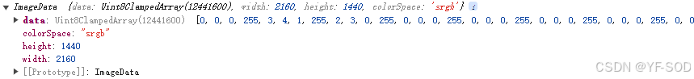

# `canvas2d`

`canvas`是`HTML5`中新增的一种标签元素，用来在网页上绘制图形，包含了很多方法。

`canvas`标签的宽和高使用属性设置，用`css`的样式设置会导致画布失真。

## 获取画布和画布上下文

```js
// 获取画布
var canvas = document.getElementById(canvasID);

// 得到画布上下文，有两个分别为2d和3d的上下文。
// 选择2d的上下文，所有的图像绘制都是通过ctx属性或者是方法进行设置，和canvas标签没有关系了。
var ctx = canvas.getContext("2d");
```

## 绘制矩形

```js
// 设置下次填充内容的颜色为红色。注意要在绘制内容前设置颜色不然无法生效。
ctx.fillStyle = "red";

// 绘制填充矩形，前2个参数为x，y轴坐标，后2个参数为x、y轴方向的长度（x轴为水平向右，y轴垂直向下）。
ctx.fillRect(100, 100, 200, 50);

// 设置下次绘制线条颜色为蓝色。注意要在绘制内容前设置颜色不然无法生效。
ctx.strokeStyle = "blue";

// 绘制矩形边框，前2个参数为x，y轴坐标，后2个参数为x、y轴方向的长度（x轴为水平向右，y轴垂直向下）。
ctx.strokeRect(300, 100, 200, 50);
```

## 清除屏幕内容（动画）

```js
// 清除矩形范围内容，前2个参数为x，y轴坐标，后2个参数为x、y轴方向的长度。
ctx.clearRect(0, 0, 600, 600);
```

像素化：使用`canvas`绘制图片成功后就会像素化，无法从画布上再次得到这个图形（即无法修改画布内容，flash 可以）。

> 注意 canvas 动画是通过清屏-更新-渲染的逻辑进行。

## 绘制不规则图形

每次设置完绘制的线条后需要调用`ctx.stroke()`绘制内容。

```js
// 创建路径
ctx.beginPath();

// 设置起点坐标
ctx.moveTo(100, 100);

// 设置下一点坐标以及连接方式为直线
ctx.lineTo(200, 200);

// 封闭路径，将最后一点坐标和起点坐标相连。注意用fill填充时，不写该条语句也会自动相连
ctx.closePath();

// 设置边框颜色
ctx.strokeStyle = "yellow";

// 通过线条绘制图形轮廓
ctx.stroke();

// 设置填充颜色
ctx.fillStyle = "blue";

// 通过填充路径的内容区域生成实心的图形
ctx.fill();
```

## 绘制圆形

```js
// 绘制圆弧，x、y为绘制圆弧的圆心；radius为半径 ；start为起始弧度（0表示x轴即水平向右）；end为结束弧度（顺时针时，是按起始弧度转end-start弧度，即相差2π时绘制的是圆，逆时针旋转时，是从start弧度逆时针转到end弧度，且start、end弧度是按照顺时针的弧度，大于2π时%2π）；anticlockwise为是否逆时针转，false为顺时针旋转；
ctx.arc(x, y, radius, start, end, anticlockwise);
```

```js
// 圆点的中心坐标
var centerX = 50;
var centerY = 50;
// 圆点的半径
var radius = 5;
// 起始角度和结束角度设置为相同的值
// 使用2*Math.PI，因为我们只想画一个圆点，而不是整个圆
ctx.beginPath();
ctx.arc(centerX, centerY, radius, 0, 2 * Math.PI);
ctx.fillStyle = "red";
ctx.fill();
```

## 设置绘制属性（线条属性、虚线等）

```js
// 设置线条的透明度，取值为0～1
ctx.globalAlpha = 0.1;

// 设置线条的宽度，默认为1
ctx.lineWidth = 1;

// 设置线段末端结束方式，默认butt为方形结束，round为半圆型结束
ctx.lineCap = "round";

// 设置线段连接处的样式，默认为miter为正常线性连接，round为连接处圆形，bevel为连接处底部为平的
ctx.lineJoin = "round";

// 设置虚线，接受一个数组，数组第一位为实线长度，第二位为虚线长度即空白的长度，第三位为实线长度，以此类推，然后用数组的内容循环设置线段的虚实
ctx.setLineDash([4, 20, ...,]);

// 设置起始的偏移量，如果设置为4，则上面从虚线即空白长度20开始
ctx.lineDashOffset = 4;
```

## 绘制文字

```js
// 设置字体大小和字体样式
ctx.font = "30px 宋体";

// 绘制文字内容，x、y为绘制的起始坐标
ctx.fillText(str, x, y);

// 设置文本水平方向对齐方式，参数有start（默认）、end（文字都在起始坐标x轴左边）、center
// 注意center表示基于起始坐标x轴居中，此时想让文本在整个canvas居中，设置fillText的x值为canvas的宽度一半即可
ctx.textAlign = "center";
```

## 颜色渐变

```js
// 设置颜色渐变的起始坐标和终点坐标，颜色会从起始坐标向终点坐标渐变
let linear = ctx.createLinearGradient(100, 100, 200, 200);

// 设置起始坐标到终点坐标上的颜色，第一个参数为当前渐变的位置（0～1之间的小数，0表示起点，0.5表示中点，1表示终点，可设置多段，从0开始向1过程中设置的颜色渐变），第二个参数为颜色
linear.addColorStop(0, "red");

// 注意最后需要将颜色设置上去即ctx.fillStyle = linear
```

## 设置阴影

```js
// X为设置阴影向右偏离距离，Y为向下的偏离距离，负为方向
ctx.shadowOffsetX|Y = 1;

// 设置模糊状态
ctx.shadowBlur = 20;

// 设置阴影颜色
ctx.shadowColor = "red";
```

## 渲染图片

```js
// img为图片对象
// 接受3个参数时(img,x,y)：x、y为图片加载位置，即渲染图片的左上角坐标起点
// 接受5个参数时（img,x,y,w,h)： x、y为图片加载位置，即渲染图片的左上角坐标起点。w为宽度，h为高度
// 接受9个参数时(img,x0,y0,w0,y0,x1,y1,w1,h1)：x0、y0、w0、h0表示从图片x0、y0位置裁剪w0宽、h0高的图片；x1、y1为图片加载位置，即渲染图片的左上角坐标起点。w1、h1为图片最后的宽、高
// 注意由于图片渲染是异步的，要在onload事件中渲染

ctx.drawImage(img, x0, y0, w0, y0, x1, y1, w1, h1);

let img = new Image();
img.src = "图片地址";
img.onload = function () {
  ctx.drawImage(img, 100, 100);
};
```

## 变形偏移

`canvas`可以进行变形偏移，变形的是整个画布的渲染区域。

注意`canvas`的每次绘制都是在上次的基础上，通过`save`、`restore`可以重新定义绘制的状态。

```js
// 保存画布的颜色、透明度等属性（strokeStyle、fillStyle、gloabalAlpha、lineWidth、lineCap、lineJoin、miterLimit、lineDashOffset、shadowOffsetX｜Y、shadowBlur、shadowColor、font、textBaseline、direction、translate等），将每次所有的属性放入一个栈中。
ctx.save();

// 恢复canvas状态，canvas状态是当前画面应用的所有样式和变形的一个快照。从save存放的栈中取出一次状态
ctx.restore();

// 绘制内容左上角起点坐标偏移到x、y，水平向右和竖直向下为正向
ctx.translate(x, y);

// 图案顺时针旋转deg弧度，初始圆心为图片的左上角顶点（可以通过translate改变圆心，x、y负数时相当于圆心在水平和竖直方向上正向移动）
ctx.rotate(deg);

// 图案在x、y轴方向的缩放倍数，默认为1，大于1代表放大，小于1代表缩小
ctx.scale(x, y);

// 是上述属性的综合写法，a、d表示水平和竖直防线的；b、c为竖直和水平防线的倾斜偏移；e、f为水平和竖直方向的移动
ctx.transform(a, b, c, d, e, f);
```

## canvas 内容转换成图片格式

```js
// 将指定canvas内容转换为base64编码的图片（图片转换为base64位编码后，图片会跟随代码（html、css、js）一起请求加载，不会单独进行请求加载），canvas为html中canvas节点而不是画布上下文。type为指定的格式（image/png、image/jpeg、image/webp等，默认为image/png）；encoderOptions为用于设置转换为base64编码后图片的质量，取值范围为0-1，超出范围用默认值0.92代替
canvas.toDataURL(type, encoderOptions);
```

## 压缩图片

```js
// mimeType对应图片的类型，0.7为压缩比例
const imageDataURL = canvas.toDataURL(mimeType, 0.7);
```

## 视频截图

下面实现了一个把`video`播放的视频通过`canvas`每`20ms`截图一次的达到用`canvas`播放效果。

```html
<body>
  <video
    id="video"
    src="hover_test.mp4"
    width="640"
    height="480"
    crossorigin="anonymous"
    autoplay
    loop
  ></video>
  <script>
    const video = document.getElementById("video");
    const canvas = document.createElement("canvas");
    const ctx = canvas.getContext("2d");
    const output = document.createElement("img");
    video.addEventListener("loadeddata", () => {
      canvas.width = video.videoWidth;
      canvas.height = video.videoHeight;
      function drawFrame() {
        if (!video.paused && !video.ended) {
          ctx.drawImage(video, 0, 0, canvas.width, canvas.height);
          output.src = canvas.toDataURL();
          document.body.appendChild(output);
          // 可以在这里做其他处理，比如保存图片
        }
        // Draw again in 20ms
        setTimeout(drawFrame, 20);
      }
      drawFrame();
    });
  </script>
</body>
```

## getImageData

获取画布指定矩形区域的像素数据，以`x`，`y`为矩形的左顶点，`width`，`height`为宽高的矩形。



其中`width`、`height`分别为`canvas`的图中对应的总宽度、总高度的像素值，`colorSpace`为每个像素点的颜色通道。

`data`为一个一维数组，数组长度为`height * width`乘`colorSpace`（通道个数，图中为 4 个，相当于）。图中`data[0]~[3]`分别对应像素点为`(0,0)`处的像素值。

`r g b`三原色对应的数值，以及一位是透明度（255 表示为完全不透明）。它是按照从左到右，从上到下的顺序去存储像素值的。

```js
ctx.getImageData(x, y, width, height);
```

## putImageData

用于将`getImageData`图像数据还原到画布上。`x`，`y`为对应矩形的左顶点。

```js
ctx.putImageData(ImageData, x, y);
```

## 图片灰度处理

```js
const ctx = canvas.getContext("2d");
ctx.drawImage(image, 0, 0, 230, 230); // image绘制到页面的 Canvas 容器
const imageData = ctx.getImageData(0, 0, canvas.width, canvas.height); // 获取的图片像素
const data = imageData.data;
const grayscale = function () {
  for (let i = 0; i < data.length; i += 4) {
    // 4 代表rgba4个色值
    const avg = (data[i] + data[i + 1] + data[i + 2]) / 3;
    data[i] = avg; // red
    data[i + 1] = avg; // green
    data[i + 2] = avg; // blue
  }
  ctx.putImageData(imageData, 0, 0);
};
```

## html 节点转 canvas 转 base64 图片下载示例（html2canvas）

注意`html`节点中如果有`img`标签，避免图片渲染不出来，需要设置属性`crossOrigin="anonymous"`。

```js
import html2canvas from "html2canvas";
const downloadFile = (content, fileName) => {
  //下载base64图片
  let base64ToBlob = function (code) {
    let parts = code.split(";base64,");
    let contentType = parts[0].split(":")[1];
    let raw = window.atob(parts[1]); //base64解码
    let rawLength = raw.length;
    let uInt8Array = new Uint8Array(rawLength);
    for (let i = 0; i < rawLength; ++i) {
      uInt8Array[i] = raw.charCodeAt(i); //将每一位转换为unicode编码
    }
    return new Blob([uInt8Array], {
      //生成二进制流
      type: contentType,
    });
  };
  let aLink = document.createElement("a");
  let blob = base64ToBlob(content); //new Blob([content]);
  let evt = document.createEvent("htmlEvents");
  evt.initEvent("click", true, true); //initEvent 不加后两个参数在FF下会报错  事件类型，是否冒泡，是否阻止浏览器的默认行为
  aLink.download = fileName;
  aLink.href = URL.createObjectURL(blob);
  aLink.click();
};
const DPR = () => {
  if (window.devicePixelRatio && window.devicePixelRatio > 1) {
    return window.devicePixelRatio;
  } else {
    return 1;
  }
};
const downloadDomPng = async () => {
  const dom = document.getElementById("convertCanvasDom"); // 获取想要转换的 DOM 节点
  const box = window.getComputedStyle(dom);
  const width = box.width; // 根据DOM节点设置宽高
  const height = box.height;
  const scaleBy = DPR(); // 获取像素比-防止模糊
  const canvas = document.createElement("canvas"); // 创建自定义 canvas 元素
  canvas.width = width * scaleBy; // 设定 canvas 元素属性宽高为 DOM 节点宽高 * 像素比
  canvas.height = height * scaleBy;
  // 设定 canvas css宽高为 DOM 节点宽高
  canvas.style.width = `${width}px`;
  canvas.style.height = `${height}px`;
  return await html2canvas(dom, {
    canvas,
    proxy: "https://baidu.com", //设置和线上相同的域名地址
    useCORS: true, //true加载跨域图像的配置
  }).then((canvas) => {
    downloadFile(canvas.toDataURL("image/png"), "filename");
  });
};
```

## canvas 例子

::: normal-demo canvas

```html
<div class="wrap">
  <div id="canvasBox">
    <canvas id="myCanvas" width="500" height="400"></canvas>
  </div>
  <div class="btns">
    <button id="drawfont">绘制文字</button>
    <button id="drawrect">画矩形</button>
    <button id="drawarc">画圆形</button>
    <button id="drawpath">画不规则路径</button>
    <button id="drawimg">画图片</button>
    <button id="toImage">转换成图片</button>

    <button id="clearcanvas">清空画布</button>
  </div>
</div>
```

```js
var canvas = document.getElementById("myCanvas");
var ctx = canvas.getContext("2d");

var canvasBox = document.getElementById("canvasBox");

var drawfont = document.getElementById("drawfont");
var drawrect = document.getElementById("drawrect");
var drawarc = document.getElementById("drawarc");
var drawpath = document.getElementById("drawpath");
var drawimg = document.getElementById("drawimg");
var toImage = document.getElementById("toImage");
var clearcanvas = document.getElementById("clearcanvas");

// 数字 偶数，图形填充；奇数，图形描边。
var num = -1;

// 绘制文字
drawfont.onclick = function () {
  ctx.font = "20px 宋体";
  ctx.fillStyle = "red";
  ctx.fillText("hello canvas", 20, 25);
  ctx.textAlign = "center";
  ctx.stroke();
  ctx.fill();
  if (num % 2 === 0) {
    // 图形填充
  } else {
    // 图形描边
  }
};

// 画矩形
drawrect.onclick = function () {
  if (num % 2 === 0) {
    // 图形填充
    ctx.fillStyle = "red";
    ctx.fillRect(20, 50, 100, 50);
  } else {
    // 图形描边
    ctx.strokeStyle = "red";
    ctx.strokeRect(20, 50, 100, 50);
  }
};

// 画圆形
drawarc.onclick = function () {
  // 创建路径
  ctx.beginPath();
  ctx.arc(70, 180, 50, 0, 2 * Math.PI);
  // 封闭路径
  ctx.closePath();

  if (num % 2 === 0) {
    // 图形填充
    ctx.fillStyle = "red";
    ctx.fill();
  } else {
    // 图形描边
    ctx.strokeStyle = "red";
    ctx.stroke();
  }
};

// 画不规则路径
drawpath.onclick = function () {
  // 创建路径
  ctx.beginPath();

  // 设置起点坐标
  ctx.moveTo(20, 310);

  // 设置下一点坐标以及连接方式为直线
  ctx.lineTo(70, 360);
  ctx.lineTo(120, 310);
  ctx.lineTo(170, 260);
  ctx.lineTo(220, 310);
  ctx.lineTo(270, 360);
  ctx.lineTo(320, 310);
  ctx.lineTo(370, 260);
  ctx.lineTo(420, 310);

  // 封闭路径
  ctx.closePath();

  if (num % 2 === 0) {
    // 图形填充
    ctx.fillStyle = "red";
    ctx.fill();
  } else {
    // 图形描边
    ctx.strokeStyle = "red";
    ctx.stroke();
  }
};

// 画图片
drawimg.onclick = function () {
  let image = new Image();
  image.src = "/assets/images/cover1.jpg";
  image.onload = function () {
    ctx.drawImage(image, 150, 50, 300, 180);
  };
  if (num % 2 === 0) {
    // 图形填充
    ctx.fill();
  } else {
    // 图形描边
    ctx.stroke();
  }
};

// 转换成图片
toImage.onclick = function () {
  // 首先将canvas转换为DataURL
  var image = new Image();
  image.src = canvas.toDataURL("image/png", 0.7);
  // 创建图片元素并添加到DOM中
  canvasBox.appendChild(image);
};

// 清空画布
clearcanvas.onclick = function () {
  // 清空
  ctx.beginPath();
  ctx.clearRect(0, 0, canvas.width, canvas.height);
  ctx.closePath();

  // 设置画布背景色
  ctx.fillStyle = "#f5f5f5";
  ctx.fillRect(0, 0, 500, 400);

  // 清除图片
  if (canvasBox.children.length > 1) {
    canvasBox.removeChild(canvasBox.children[canvasBox.children.length - 1]);
  }

  num++;
};

// 初始化画布
clearcanvas.onclick();
```

```css
.wrap {
  display: flex;
  justify-content: space-between;
}
.btns {
  width: 110px;
  flex-shrink: 0;
}

button:nth-child(n + 2) {
  margin-top: 10px;
}
```

:::
