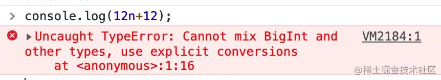
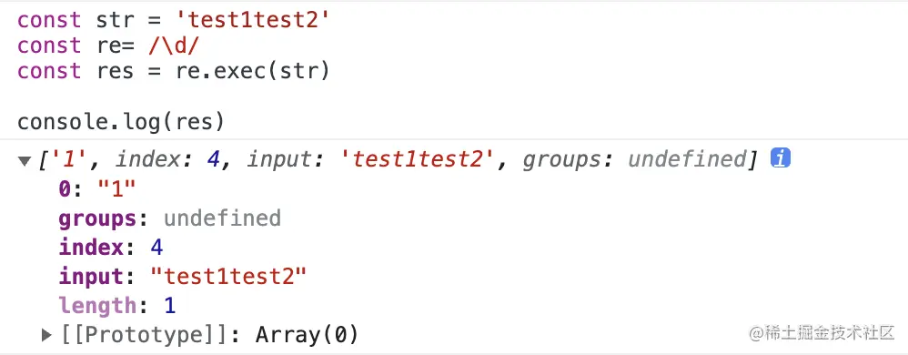
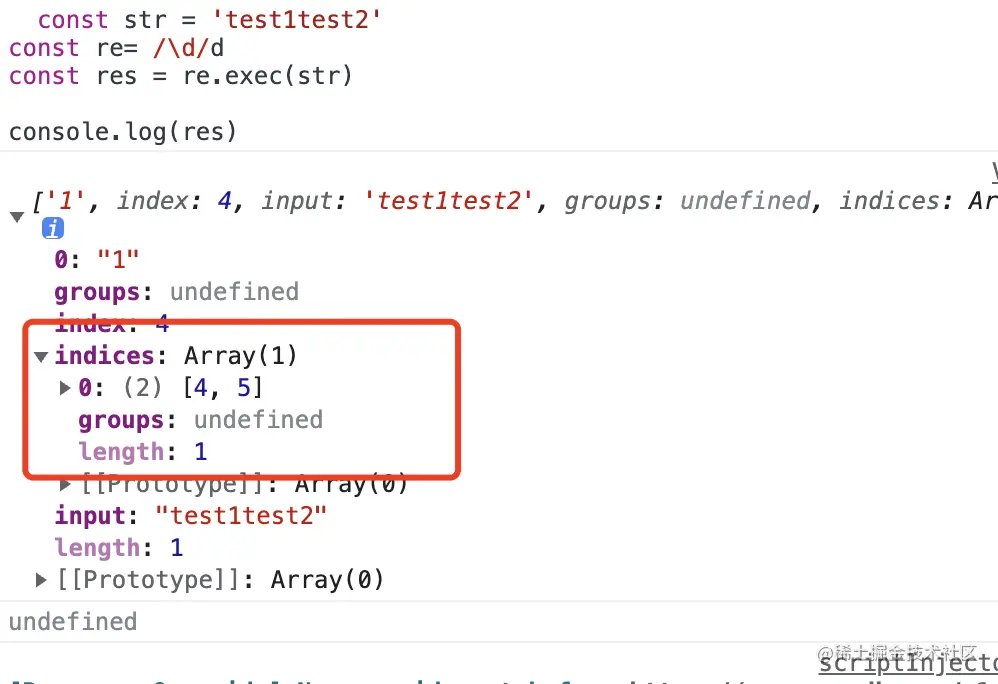

# ES7 到 ES13

## 数组扩展（ES7）

- `includes()`：在`ES6`的基础上增加了一个索引，代表是从哪开始寻找。

```js
let arr = [1, 2, 3, 4];

//includes() ES6
console.log(arr.includes(3)); // true
console.log([1, 2, NaN].includes(NaN)); // true

// includes() ES7
console.log(arr.includes(1, 0)); // true
console.log(arr.includes(1, 1)); // false
```

## 数值扩展（ES7）

- 幂运算符：用`**`代表`Math.pow()`。

```js
// 幂运算符 ES7
console.log(Math.pow(2, 3)); // 8
console.log(2 ** 8); // 256
```

## 字符串扩展（ES8）

- `padStart()`：用于头部补全。
- `padEnd()`：用于尾部补全。

```js
let str = "Domesy";

//padStart(): 会以空格的形式补位吗，这里用0代替，第二个参数会定义一个模板形式，会以模板进行替换
console.log("1".padStart(2, "0")); // 01
console.log("8-27".padStart(10, "YYYY-0M-0D")); //  YYYY-08-27

// padEnd()：与padStart()用法相同
console.log("1".padEnd(2, "0")); // 10
```

## 对象扩展（ES8）

- `Object.values()`：返回属性值。
- `Object.entries()`：返回属性名和属性值的数组。

```js
let obj = { name: "Domesy", value: "React" };

//Object.values()
console.log(Object.values(obj)); // ['Domesy', 'React']

//Object.entries()
console.log(Object.entries(obj)); // [['name', 'value'], ['React', 'React']]
```

## async await（ES8）

作用： 将异步函数改为同步函数，（`Generator`的语法糖）。

```js
const func = async () => {
  let promise = new Promise((resolve, reject) => {
    setTimeout(() => {
      resolve("执行");
    }, 1000);
  });

  console.log(await promise);
  console.log(await 0);
  console.log(await Promise.resolve(1));
  console.log(2);
  return Promise.resolve(3);
};

func().then((val) => {
  console.log(val); // 依次执行： 执行 0 1 2 3
});
```

特别注意：

- `async`函数 返回`Promise`对象，因此可以使用`then`。
- `awit`命令，只能用在`async`函数下，否则会报错。
- 数组的`forEach()`执行`async/await`会失效，可以使用`for-of`和`Promise.all()`代替。
- 无法处理`promise`返回的`reject`对象，需要使用`try catch`来捕捉。

### await 等到了之后做了什么？

这里分为两种情况：是否为`promise`对象。

如果它等到的不是一个`promise`对象，`await`会阻塞后面的代码，先执行`async`外面的同步代码，同步代码执行完，再回到`async`内部，把这个非`promise`的东西，作为`await`表达式的结果。

如果它等到的是一个`promise`对象，`await`也会暂停`async`后面的代码，先执行`async`外面的同步代码，等着`Promise`对象`fulfilled`，然后把`resolve`的参数作为`await`表达式的运算结果。

### async await 与 promise 的优缺点

优点：

- 它做到了真正的串行的同步写法，代码阅读相对容易。
- 对于条件语句和其他流程语句比较友好，可以直接写到判断条件里面。
- 处理复杂流程时，在代码清晰度方面有优势。

缺点：

- 用`await`可能会导致性能问题，因为`await`会阻塞代码，也许之后的异步代码并不依赖于前者，但仍然需要等待前者完成，导致代码失去了并发性。

## 字符串扩展（ES9）

- **放松对标签模板里字符串转义的限制**：遇到不合法的字符串转义返回`undefined`，并且从`raw`上可获取原字符串。

```js
// 放松字符串的限制
const test = (value) => {
  console.log(value);
};
test`domesy`; // ['domesy', raw: ["domesy"]]
```

## Promise（ES9）

### Promise.finally()

不管最后状态如何都会执行的回调函数。

```js
let func = (time) => {
  return new Promise((res, rej) => {
    setTimeout(() => {
      if (time < 500) {
        res(time);
      } else {
        rej(time);
      }
    }, time);
  });
};

func(300)
  .then((val) => console.log("res", val))
  .catch((erro) => console.log("rej", erro))
  .finally(() => console.log("完成"));
// 执行结果： res 300  完成

func(700)
  .then((val) => console.log("res", val))
  .catch((erro) => console.log("rej", erro))
  .finally(() => console.log("完成"));
// 执行结果： rej 700  完成
```

## for-await-of（ES9）

`for-await-of`：异步迭代器，循环等待每个`Promise`对象变为`resolved`状态才进入下一步。

```js
let getTime = (seconds) => {
  return new Promise((res) => {
    setTimeout(() => {
      res(seconds);
    }, seconds);
  });
};

async function test() {
  let arr = [getTime(2000), getTime(500), getTime(1000)];
  for await (let x of arr) {
    console.log(x);
  }
}

test(); //以此执行 2000  500 1000
```

## 字符串扩展（ES10）

- `JSON.stringify()`：可返回不符合`UTF-8`标准的字符串(直接输入`U+2028`和`U+2029`可输入)。

```js
//JSON.stringify() 升级
console.log(JSON.stringify("\uD83D\uDE0E")); // 😎
console.log(JSON.stringify("\u{D800}")); // \ud800
```

## 数组扩展（ES10）

- `flatMap()`：方法首先使用映射函数映射每个元素，然后将结果压缩成一个新数组。(注：它与`map`连着深度值为 1 的`flat`几乎相同，但`flatMap`通常在合并成一种方法的效率稍微高一些。)
- `flat()`：方法会按照一个可指定的深度递归遍历数组，并将所有元素与遍历到的子数组中的元素合并为一个新数组返回。默认为 1。(应用：数组扁平化。(当输入`Infinity`自动解到最底层))

```js
let arr = [1, 2, 3, 4];

// flatMap()
console.log(arr.map((x) => [x * 2])); // [ [ 2 ], [ 4 ], [ 6 ], [ 8 ] ]
console.log(arr.flatMap((x) => [x * 2])); // [ 2, 4, 6, 8 ]
console.log(arr.flatMap((x) => [[x * 2]])); // [ [ 2 ], [ 4 ], [ 6 ], [ 8 ] ]

const arr1 = [0, 1, 2, [3, 4]];
const arr2 = [0, 1, 2, [[[3, 4]]]];

console.log(arr1.flat()); // [ 0, 1, 2, 3, 4 ]
console.log(arr2.flat(2)); // [ 0, 1, 2, [ 3, 4 ] ]
console.log(arr2.flat(Infinity)); // [ 0, 1, 2, 3, 4 ]
```

## 对象扩展（ES10）

### Object.fromEntries()

- 返回键和值组成的对象，相当于`Object.entries()`的逆操作。
- 可以做一些数据类型的转化。

#### Map 转化为 Object

```js
let map = new Map([
  ["a", 1],
  ["b", 2],
]);

let obj = Object.fromEntries(map);
console.log(obj); // {a: 1, b: 2}
```

#### Array 转化为 Object

```js
// 注意数组的形式
let arr = [
  ["a", 1],
  ["b", 2],
];
let obj = Object.fromEntries(arr);
console.log(obj); // {a: 1, b: 2}
```

#### 对象转换

```js
let obj = {
  a: 1,
  b: 2,
  c: 3,
};

let res = Object.fromEntries(
  Object.entries(obj).filter(([key, val]) => value !== 3)
);

console.log(res); //{a: 1, b: 2}
```

## 数值扩展（ES10）

- `toString()`改造：返回函数原始代码(与编码一致)。

```js
//toString()
function test() {
  consople.log("domesy");
}
console.log(test.toString());
//  function test () {
//      consople.log('domesy')
//  }
```

## 可选的 Catch 参数（ES10）

在 ES10 中，`try catch`可忽略`catch`的参数。

```js
let func = (name) => {
  try {
    return JSON.parse(name);
  } catch {
    return false;
  }
};

console.log(func(1)); // 1
console.log(func({ a: "1" })); // false
```

## BigInt(原始类型)（ES11）

- 新的原始数据类型：`BigInt`，表示一个任意精度的整数，可以表示超长数据，可以超出 2 的 53 次方。
- js 中`Number`类型只能安全的表示`-(2^53-1)`至`2^53-1`范围的值。

特别注意：

- `Number`类型的数字有精度限制，数值的精度只能到 53 个二进制位（相当于 16 个十进制位, `正负9007199254740992`），大于这个范围的整数，就无法精确表示了。
- `BigInt`没有位数的限制，任何位数的整数都可以精确表示。但是其只能用于表示整数，且为了与`Number`进行区分，`BigInt`类型的数据必须添加后缀**n**。
- `BigInt`可以使用负号，但是不能使用正号。
- `number`类型的数字和`BigInt`类型的数字不能混合计算。

```js
// Number
console.log(2 ** 53); // 9007199254740992
console.log(Number.MAX_SAFE_INTEGER); // 9007199254740991

//BigInt
const bigInt = 9007199254740993n;
console.log(bigInt); // 9007199254740993n
console.log(typeof bigInt); // bigint
console.log(1n == 1); // true
console.log(1n === 1); // false
const bigIntNum = BigInt(9007199254740993n);
console.log(bigIntNum); // 9007199254740993n
```



## 基本数据类型（ES11）

在 ES6 中一共有 7 种，分别是：`srting`、`number`、`boolean`、`object`、`null`、`undefined`、`symbol`。

其中`object`包含：`Array`、`Function`、`Date`、`RegExp`。

而在 ES11 后新增一种，为 8 种 分别是：`srting`、`number`、`boolean`、`object`、`null`、`undefined`、`symbol`、`BigInt`。

## Promise（ES11）

### Promise.allSettled()

- 将多个实例包装成一个新实例，返回全部实例状态变更后的状态数组(齐变更再返回)。
- 无论结果是`fulfilled`还是`rejected`，无需`catch`。
- 相当于增强了`Promise.all()`。

```js
Promise.allSettled([
  Promise.reject({
    code: 500,
    msg: "服务异常",
  }),
  Promise.resolve({
    code: 200,
    data: ["1", "2", "3"],
  }),
  Promise.resolve({
    code: 200,
    data: ["4", "5", "6"],
  }),
]).then((res) => {
  console.log(res); // [{ reason: {code: 500, msg: '服务异常'}, status: "rejected" },
  // { reason: {code: 200, data: ["1", "2", "3"]}, status: "rejected" },
  // { reason: {code: 200, data: ["4", "5", "6"]}, status: "rejected" }]
  const data = res.filter((item) => item.status === "fulfilled");
  console.log(data); // [{ reason: {code: 200, data: ["1", "2", "3"]}, status: "rejected" },
  // { reason: {code: 200, data: ["4", "5", "6"]}, status: "rejected" }]
});
```

## import()动态导入（ES11）

- 按需获取的动态`import`。该类函数格式（并非继承`Function.prototype`）返回`promise`函数。
- 与`require`的区别是：`require()`是同步加载，`import()`是异步加载。

```js
// then()
let modulePage = "index.js";
import(modulePage).then((module) => {
  module.init();
});

// 结合 async await
async () => {
  const modulePage = "index.js";
  const module = await import(modulePage);
  console.log(module);
};
```

## globalThis（ES11）

- 全局`this`，**无论是什么环境（浏览器，node 等），始终指向全局对象**。

```js
// 浏览器环境
console.log(globalThis); //  window

// node
console.log(globalThis); //  global
```

## 可选链（ES11）

- 符号`？`代表是否存在。
- TypeScript 在 3.7 版本已实现了此功能。

```js
const user = { name: "domesy" };
//ES11之前
let a = user && user.name;

//现在
let b = user?.name;
```

## 空值合并运算符（ES11）

- 处理默认值的便捷运算符。
- 与`||`相比，空值合并运算符`??`只会在左边的值严格等于`null`或`undefined`时起作用。

```js
"" || "default value"; // default value
"" ?? "default value"; // ""

const b = 0;
const a = b || 5;
console.log(a); // 5

const b = null; // undefined
const a = b ?? 123;
console.log(a); // 123
```

## 字符串扩展（ES12）

### replaceAll()

- `replace()`方法仅替换一个字符串中某模式（pattern）的首个实例。
- `replaceAll()`会返回一个新字符串，该字符串中用一个替换项替换了原字符串中所有匹配了某模式的部分。
- 模式可以是一个字符串或一个正则表达式，而替换项可以是一个字符串或一个应用于每个匹配项的函数。
- `replaceAll()`相当于增强了`replace()`的特性，全量替换。

```js
let str = "Hi！，这是ES6~ES12的新特性，目前为ES12";

console.log(str.replace("ES", "SY")); // Hi！，这是SY6~ES12的新特性，目前为ES12
console.log(str.replace(/ES/g, "Sy")); // Hi！，这是Sy6~Sy12的新特性，目前为Sy12

console.log(str.replaceAll("ES", "Sy")); // Hi！，这是Sy6~Sy12的新特性，目前为Sy12
console.log(str.replaceAll(/ES/g, "Sy")); // Hi！，这是Sy6~Sy12的新特性，目前为Sy12
```

## Promise（ES12）

### Promise.any()

区别于`Promise.race()`，尽管某个`promise`的`reject`早于另一个`promise`的`resolve`，`Promise.any()`仍将返回那个首先`resolve`的`promise`。

```js
Promise.any([
  Promise.reject("Third"),
  Promise.resolve("Second"),
  Promise.resolve("First"),
])
  .then((res) => console.log(res)) // Second
  .catch((err) => console.error(err));

Promise.any([
  Promise.reject("Error 1"),
  Promise.reject("Error 2"),
  Promise.reject("Error 3"),
])
  .then((res) => console.log(res))
  .catch((err) => console.error(err));
// AggregateError: All promises were rejected

Promise.any([
  Promise.resolve("Third"),
  Promise.resolve("Second"),
  Promise.resolve("First"),
])
  .then((res) => console.log(res)) // Third
  .catch((err) => console.error(err));
```

## WeakRefs（ES12）

- 允许创建对象的弱引用。这样就能够在跟踪现有对象时不会阻止对其进行垃圾回收。对于缓存和对象映射非常有用。
- 必须用`new`关键字创建新的`WeakRef`。
- `deref()`读取引用的对象。
- 正确使用`WeakRef`对象需要仔细的考虑，最好尽量避免使用。避免依赖于规范没有保证的任何特定行为也是十分重要的。何时、如何以及是否发生垃圾回收取决于任何给定 JavaScript 引擎的实现。

```js
let weakref = new WeakRef({ name: "domesy", year: 24 });

weakref.deref(); // {name: 'domesy', year: 24}
weakref.deref().year; // 24
```

## 逻辑操作符和赋值表达（ES12）

### &&=

```js
let num1 = 5;
let num2 = 10;
num1 &&= num2;
console.log(num1); // 10

// 等价于
num1 && (num1 = num2);
if (num1) {
  num1 = num2;
}
```

### ||=

```js
let num1;
let num2 = 10;
num1 ||= num2;
console.log(num1); // 10

// 等价于
num1 || (num1 = num2);
if (!num1) {
  num1 = num2;
}
```

### ??=

空值合并运算符`??`只会在左边的值严格等于`null`或`undefined`时起作用。

```js
let num1;
let num2 = 10;
let num3 = null; // undefined

num1 ??= num2;
console.log(num1); // 10

num1 = false;
num1 ??= num2;
console.log(num1); // false

num3 ??= 123;
console.log(num3); // 123

// 等价于
// num1 ?? (num1 = num2);
```

## 数值分隔符（ES12）

```js
let num1 = 100000;
let num2 = 100_000;

console.log(num1); // 100000
console.log(num2); // 100000

const num3 = 10.12_34_56;
console.log(num3); // 10.123456
```

## 类（ES13）

### 声明

类（即 class）的声明需要依靠`constructor`来基本定义和生成实例，在 ES13 后就不需要这个方法了，即：

```js
class Post {
  name = "小杜杜";
  age;
  sex;
}
```

### 私有字段

私有字段，在 ES13 后可用`#`代表，如：

```js
class Post{
  #name = '小杜杜';

  #getName(){
    return #name
  }
}
```

### 静态字段

ES13 同时还提供了以`static`的静态公有字段，如：

```js
class Post{
  static name = '小杜杜';

  static getName(){
    return #name
  }
}
```

## 正则（ES13）

在 ES13 中，提供了`/d`标志，去获取关于输入字符串中每个匹配项开始和索引位置结束的额外信息，如：

```js
const str = "test1test2";
const re = /\d/;
const res = re.exec(str);

console.log(res);
```



再来看看加入`/d`的：

```js
const str = "test1test2";
const re = /\d/d;
const res = re.exec(str);

console.log(res);
```



可以发现多了一个属性`.indices`。

## async await（ES13）

`async await`都是一起出现的，然而在 ES13 中提供了顶级`await`，简单的说`await`想要单飞，不要`async`了。

```js
const fn = (time) => {
  return new Promise((resolve) => {
    setTimeout(resolve, time);
  });
};

//之前写法
async () => {
  await fn(1000);
  // ...//执行下面的
};

//单飞后
await fn(1000);
// ...//执行下面的
```

这种顶层的`await`有什么用？

其实这种模式相当于直接动态加载模块，同时可以配合`try catch`做一些版本的判断（根据浏览的版本做一些处理）。

## Array（ES13）

### at()

简单的说就是可以支持负数查找对应的值（倒着数），如：

```js
const arr = [1, 2, 3, 4, 5, 6, 7, 8, 9, 10];
console.log(arr.at(-2)); // 9 => 等价于 arr[arr.length - 2]
console.log(arr.at(8)); // 9
```

## Object（ES13）

### hasOwn

简单的来讲，就是替换了原先的`hasOwnProperty`，检查是否存在属性、方法，返回布尔值，但需要注意一点，这里的检验必须是自身的属性、方法，而非继承的，如：

```js
function Info(name) {
  this.name = name;
}

Info.prototype.getName = function () {
  console.log(this.name);
};

const info = new Info("小杜杜");

// hasOwnProperty
info.hasOwnProperty("name"); // true
info.hasOwnProperty("getName"); // false

// hasOwn
info.hasOwn("name"); // true
info.hasOwn("getName"); // false
```

## 文章地址

https://juejin.cn/post/7068935394191998990?searchId=2025022515023444D92E85D037A406B9DB#heading-34

<!--
2015 es6
2016 es7
2017 es8
2018 es9
2019 es10
2020 es11
2021 es12
2022 es13

2023 es14
2024 es15
2025 es16 -->
