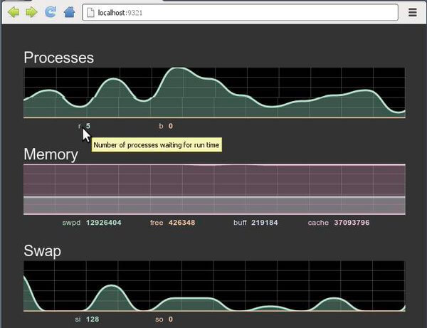
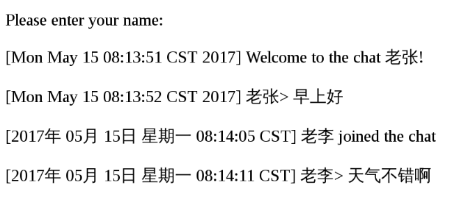

# WebSocket

[文章摘自阮一峰的《WebSocket 教程》](https://www.ruanyifeng.com/blog/2017/05/websocket.html)

[WebSocket](https://websocket.org/)是一种网络通信协议，很多高级功能都需要它。

本文介绍`WebSocket`协议的使用方法。

## 为什么需要`WebSocket`

初次接触`WebSocket`的人，都会问同样的问题：我们已经有了`HTTP`协议，为什么还需要另一个协议？它能带来什么好处？

答案很简单，因为`HTTP`协议有一个缺陷：通信只能由客户端发起。

举例来说，我们想了解今天的天气，只能是客户端向服务器发出请求，服务器返回查询结果。`HTTP`协议做不到服务器主动向客户端推送信息。


这种单向请求的特点，注定了如果服务器有连续的状态变化，客户端要获知就非常麻烦。我们只能使用["轮询"](https://www.pubnub.com/blog/2014-12-01-http-long-polling/)：每隔一段时候，就发出一个询问，了解服务器有没有新的信息。最典型的场景就是聊天室。

轮询的效率低，非常浪费资源（因为必须不停连接，或者`HTTP`连接始终打开）。因此，工程师们一直在思考，有没有更好的方法。`webSocket`就是这样发明的。

## 简介

`WebSocket`协议在 2008 年诞生，2011 年成为国际标准。所有浏览器都已经支持了。

它的最大特点就是，服务器可以主动向客户端推送信息，客户端也可以主动向服务器发送信息，是真正的双向平等对话，属于[服务器推送技术](https://en.wikipedia.org/wiki/Push_technology)的一种。


其特点包括：

1. 建立在`TCP`协议之上，服务器端的实现比较容易。
2. 与`HTTP`协议有着良好的兼容性。默认端口也是 80 和 443，并且握手阶段采用`HTTP`协议，因此握手时不容易屏蔽，能通过各种`HTTP`代理服务器。
3. 数据格式比较轻量，性能开销小，通信高效。
4. 可以发送文本，也可以发送二进制数据。
5. 没有同源限制，客户端可以与任意服务器通信。
6. 协议标识符是`ws`（如果加密，则为`wss`），服务器网址就是`URL`。
   ```
   ws://example.com:80/some/path
   ```


## 客户端的简单示例

`WebSocket`的用法相当简单。

下面是一个网页脚本的例子（点击[这里](https://jsbin.com/muqamiqimu/edit?js,console)看运行结果），基本上一眼就能明白。

```js
var ws = new WebSocket("wss://echo.websocket.org");

ws.onopen = function (evt) {
  console.log("Connection open ...");
  ws.send("Hello WebSockets!");
};

ws.onmessage = function (evt) {
  console.log("Received Message: " + evt.data);
  ws.close();
};

ws.onclose = function (evt) {
  console.log("Connection closed.");
};
```

## 客户端的`API`

`WebSocket`客户端的`API`如下。

### `WebSocket`构造函数

`WebSocket`对象作为一个构造函数，用于新建`WebSocket`实例。

```js
var ws = new WebSocket("ws://localhost:8080");
```

执行上面语句之后，客户端就会与服务器进行连接。

实例对象的所有属性和方法清单，参见[这里](https://developer.mozilla.org/en-US/docs/Web/API/WebSocket)。

### `webSocket.readyState`

`readyState`属性返回实例对象的当前状态，共有四种。

- `CONNECTING`：值为 0，表示正在连接。
- `OPEN`：值为 1，表示连接成功，可以通信了。
- `CLOSING`：值为 2，表示连接正在关闭。
- `CLOSED`：值为 3，表示连接已经关闭，或者打开连接失败。

下面是一个示例：

```js
switch (ws.readyState) {
  case WebSocket.CONNECTING:
    // do something
    break;
  case WebSocket.OPEN:
    // do something
    break;
  case WebSocket.CLOSING:
    // do something
    break;
  case WebSocket.CLOSED:
    // do something
    break;
  default:
    // this never happens
    break;
}
```

### `webSocket.onopen`

实例对象的`onopen`属性，用于指定连接成功后的回调函数。

```js
ws.onopen = function () {
  ws.send("Hello Server!");
};
```

如果要指定多个回调函数，可以使用`addEventListener`方法。

```js
ws.addEventListener("open", function (event) {
  ws.send("Hello Server!");
});
```

### `webSocket.onclose`

实例对象的`onclose`属性，用于指定连接关闭后的回调函数。

```js
ws.onclose = function (event) {
  var code = event.code;
  var reason = event.reason;
  var wasClean = event.wasClean;
  // handle close event
};

ws.addEventListener("close", function (event) {
  var code = event.code;
  var reason = event.reason;
  var wasClean = event.wasClean;
  // handle close event
});
```

### `webSocket.onmessage`

实例对象的`onmessage`属性，用于指定收到服务器数据后的回调函数。

```js
ws.onmessage = function (event) {
  var data = event.data;
  // 处理数据
};

ws.addEventListener("message", function (event) {
  var data = event.data;
  // 处理数据
});
```

注意，服务器数据可能是文本，也可能是二进制数据（`blob`对象或`Arraybuffer`对象）。

```js
ws.onmessage = function (event) {
  if (typeof event.data === String) {
    console.log("Received data string");
  }

  if (event.data instanceof ArrayBuffer) {
    var buffer = event.data;
    console.log("Received arraybuffer");
  }
};
```

除了动态判断收到的数据类型，也可以使用`binaryType`属性，显式指定收到的二进制数据类型。

```js
// 收到的是 blob 数据
ws.binaryType = "blob";
ws.onmessage = function (e) {
  console.log(e.data.size);
};

// 收到的是 ArrayBuffer 数据
ws.binaryType = "arraybuffer";
ws.onmessage = function (e) {
  console.log(e.data.byteLength);
};
```

### `webSocket.send()`

实例对象的`send()`方法用于向服务器发送数据。

发送文本的例子：

```js
ws.send("your message");
```

发送`Blob`对象的例子：

```js
var file = document.querySelector('input[type="file"]').files[0];
ws.send(file);
```

发送`ArrayBuffer`对象的例子：

```js
// Sending canvas ImageData as ArrayBuffer
var img = canvas_context.getImageData(0, 0, 400, 320);
var binary = new Uint8Array(img.data.length);
for (var i = 0; i < img.data.length; i++) {
  binary[i] = img.data[i];
}
ws.send(binary.buffer);
```

### `webSocket.bufferedAmount`

实例对象的`bufferedAmount`属性，表示还有多少字节的二进制数据没有发送出去。它可以用来判断发送是否结束。

```js
var data = new ArrayBuffer(10000000);
socket.send(data);

if (socket.bufferedAmount === 0) {
  // 发送完毕
} else {
  // 发送还没结束
}
```

### `webSocket.onerror`

实例对象的`onerror`属性，用于指定报错时的回调函数。

```js
socket.onerror = function (event) {
  // handle error event
};

socket.addEventListener("error", function (event) {
  // handle error event
});
```

## 服务端的实现

`WebSocket`服务器的实现，可以查看维基百科的[列表](https://en.wikipedia.org/wiki/Comparison_of_WebSocket_implementations)。

常用的`Node`实现有以下三种：

- [µWebSockets](https://github.com/uNetworking/uWebSockets)。
- [Socket.IO](https://socket.io/)。
- [WebSocket-Node](https://github.com/theturtle32/WebSocket-Node)。

具体的用法请查看它们的文档，这里不详细介绍了。

## `WebSocketd`

下面，我要推荐一款非常特别的`WebSocket`服务器：[Websocketd](http://websocketd.com/)。

它的最大特点，就是后台脚本不限语言，标准输入（stdin）就是`WebSocket`的输入，标准输出（stdout）就是`WebSocket`的输出。

举例来说，下面是一个`Bash`脚本`counter.sh`。

```bash
#!/bin/bash

echo 1
sleep 1

echo 2
sleep 1

echo 3
```

命令行下运行这个脚本，会输出 1、2、3，每个值之间间隔 1 秒。

```bash
$ bash ./counter.sh
1
2
3
```

现在，启动`websocketd`，指定这个脚本作为服务。

```bash
$ websocketd --port=8080 bash ./counter.sh
```

上面的命令会启动一个`WebSocket`服务器，端口是 8080。每当客户端连接这个服务器，就会执行`counter.sh`脚本，并将它的输出推送给客户端。

```js
var ws = new WebSocket("ws://localhost:8080/");

ws.onmessage = function (event) {
  console.log(event.data);
};
```

上面是客户端的`JavaScript`代码，运行之后会在控制台依次输出 1、2、3。

有了它，就可以很方便地将命令行的输出，发给浏览器。

```bash
$ websocketd --port=8080 ls
```

上面的命令会执行`ls`命令，从而将当前目录的内容，发给浏览器。使用这种方式实时监控服务器，简直是轻而易举（[代码](https://github.com/joewalnes/web-vmstats)）。



更多的用法可以参考[官方示例](https://github.com/joewalnes/websocketd/tree/master/examples/bash)。

- `Bash`脚本[读取客户端输入](https://github.com/joewalnes/websocketd/blob/master/examples/bash/greeter.sh)的例子。

```bash
#!/bin/bash

# Copyright 2013 Joe Walnes and the websocketd team.
# All rights reserved.
# Use of this source code is governed by a BSD-style
# license that can be found in the LICENSE file.

# For each line FOO received on STDIN, respond with "Hello FOO!".
while read LINE
do
	echo "Hello $LINE!"
done
```

- 五行代码实现一个最简单的[聊天服务器](https://github.com/joewalnes/websocketd/blob/master/examples/bash/chat.sh)。

```bash
#!/bin/bash

# Copyright 2013 Jeroen Janssens
# All rights reserved.
# Use of this source code is governed by a BSD-style
# license that can be found in the LICENSE file.

# Run a simple chat server: websocketd --devconsole --port 8080 ./chat.sh
#
# Please note that this example requires GNU tail, which is not the default
# tail on OS X. Even though this script properly escapes the variables,
# please keep in mind that it is in general a bad idea to read
# untrusted data into variables and pass this onto the command line.

echo "Please enter your name:"; read USER
echo "[$(date)] ${USER} joined the chat" >> chat.log
echo "[$(date)] Welcome to the chat ${USER}!"
tail -n 0 -f chat.log --pid=$$ | grep --line-buffered -v "] ${USER}>" &
while read MSG; do echo "[$(date)] ${USER}> ${MSG}" >> chat.log; done
```



`websocketd`的实质，就是命令行的`WebSocket`代理。只要命令行可以执行的程序，都可以通过它与浏览器进行`WebSocket`通信。下面是一个`Node`实现的回声服务[greeter.js](https://github.com/joewalnes/websocketd/blob/master/examples/nodejs/greeter.js)。

```js
// from node.js sample
// https://nodejs.org/api/process.html#process_process_stdin
process.stdin.setEncoding("utf8");

process.stdin.on("readable", function () {
  var chunk = process.stdin.read();
  if (chunk !== null) {
    process.stdout.write("data: " + chunk);
  }
});
```

启动这个脚本的命令如下：

```bash
$ websocketd --port=8080 node ./greeter.js
```

官方仓库还有其他[各种语言](https://github.com/joewalnes/websocketd/tree/master/examples)的例子。

## `GoEasy WebSocket`消息推送服务

大家看了前面的介绍，可能已经发现了，`WebSocket`的使用有一个前提条件，就是要自己搭建一个服务。

但是很多时候，它只是一个前后端消息的中介，没有其他功能。单独搭一个服务似乎有点麻烦，尤其是在你的应用并不大的情况下。

很多开发者都希望，直接使用现成的`WebSocket`服务，免得自己搭建，最好还是免费的。

下面就介绍一个国内这样的`WebSocket`服务商[GoEasy](https://www.goeasy.io/cn/websocket.html?s=ryf)。你不需要自己搭建了，前后端接入他们的服务器就可以了，他们的机器都在国内，速度和可靠性有保证。

示例代码可以[参考文档](https://docs.goeasy.io/2.x/pubsub/get-start?s=ryf)，只要几行，就能立刻使用`WebSocket`了。

服务端使用`PHP`、`C#`、`Java`、`Go`、`Node`、`Python`等各种语言，都没有问题。客户端支持`Uniapp`、各种小程序、`Web`等不同应用和`Vue`、`React`、`Taro`等主流框架。

[GoEasy](https://www.goeasy.io/cn/websocket.html?s=ryf)2015 年就上线了，有很多大企业客户，做到了百万级用户同时在线，每秒千万级消息的实时送达。他们保证消息数据全程加密传输，高并发、低延时，99.95%的高可用。

只要你的 DAU（日活跃用户数）不超过 200，他们的服务是永久免费的，对于个人的小型应用应该够用了。企业的商业项目需要付费，还提供私有部署。

## 参考链接

- [How to Use WebSockets](https://cjihrig.com/blog/how-to-use-websockets)。
- [WebSockets - Send & Receive Messages](https://www.tutorialspoint.com/websockets/websockets_send_receive_messages.htm)。
- [Introducing WebSockets: Bringing Sockets to the Web](https://web.dev/articles/websockets-basics?hl=zh-cn)。
