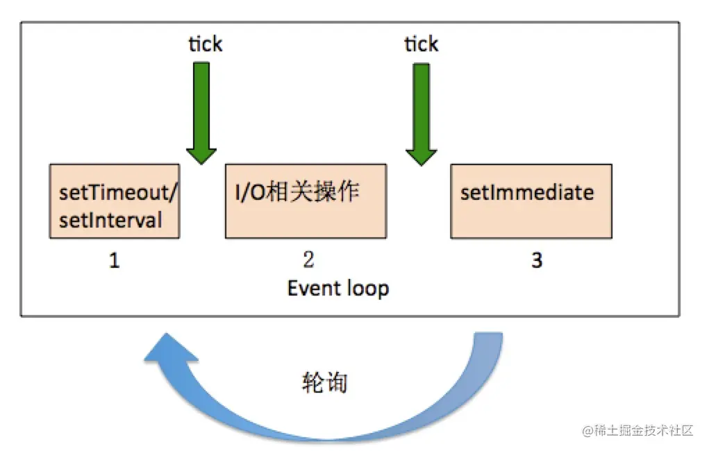

# setTimeout 和 setImmediate 和 process.nextTick

在 Node.js 中，`setTimeout`、`setImmediate`和`process.nextTick`是用于调度异步操作的三种不同机制。它们之间的区别在于事件循环中的执行顺序和优先级。

## 前言

在 Node.js 中，处理异步操作是非常常见的，因为它是单线程的，但又需要处理大量的 I/O 操作。为了能够高效地处理异步任务，Node.js 采用了事件循环机制，而`setTimeout`、`setImmediate`和`process.nextTick`是事件循环中的三个关键概念。

## setTimeout

`setTimeout`是一个用于设置在一定延迟后执行的定时器。它允许您执行代码，但会在一定时间后将其插入事件队列。`setTimeout`的第一个参数是回调函数，第二个参数是延迟时间（以毫秒为单位）。

特性和用法：

- `setTimeout`的回调函数将被插入到事件队列的定时器队列中。
- 回调函数执行的时间不是精确的，而是在至少延迟指定时间后执行。
- 如果在事件队列中存在其他阻塞操作，`setTimeout`的回调函数可能会延迟执行。
- 可以用`clearTimeout`来取消尚未执行的`setTimeout`。
- 适用于一般的异步操作和延迟执行。

```js
setTimeout(() => {
  console.log("This will be executed after 1000ms");
}, 1000);
```

## setImmediate

`setImmediate`是一个用于安排立即执行的定时器。它在事件循环的检查阶段（check phase）执行，确保回调函数在 I/O 操作和定时器之后尽快执行。

特性和用法：

- `setImmediate`的回调函数将在事件队列的下一个检查阶段执行。
- 优先级比`setTimeout`高，确保回调函数尽快执行。
- 适用于需要尽快执行的回调函数，尤其是在 I/O 操作之后。

```js
setImmediate(() => {
  console.log("This will be executed immediately");
});
```

## process.nextTick

`process.nextTick`是一个特殊的函数，用于将回调函数插入到事件循环的"next tick"队列中。这意味着回调函数会在当前阶段完成后立即执行，而不是等待下一个阶段。

特性和用法：

- `process.nextTick`的回调函数会在当前阶段的末尾立即执行。
- 具有最高的优先级，优先于`setImmediate`。
- 适用于需要在当前操作结束后立即执行的回调函数，如递归、事件发射和错误处理。

```js
process.nextTick(() => {
  console.log("This will be executed on the next tick");
});
```

## 执行机制

一个有趣的现象：

```js
setTimeout(() => {
  console.log("setTimeout");
}, 0);

setImmediate(() => {
  console.log("setImmediate");
});
```

输出的结果时而是：

```js
setTimeout;
setImmediate;
```

时而是：

```js
setImmediate;
setTimeout;
```

为啥这两个函数的执行的顺序如此不固定呢？难道有随机性存在吗？ 其实不然，我们来看一张图：



这是整个 event loop 的简略图，很多东西我都删减掉了，I/O 里面的细节操作我逗缩写在一个步骤里了。
我们用通俗距离方法来说吧，`setTimeout`和`setInterval`的等级是一样的，所以方法在代码里按照先后顺序注册执行。但是按上面代码输出，为什么 1 和 3 的步骤会出现随机性输出呢？

> `setTimeout`的回调函数在 1 阶段执行，`setImmediate`的回调函数在 3 阶段执行。event loop 先检测 1 阶段，这个是正确的，官方文档也说了 The event loop cycle is timers -> I/O -> immediates, rinse and repeat. 但是有个问题就是进入第一个 event loop 时间不确定，不一定就是从头开始进
> 入的，上面的例子进入的时间并不完整。网上有人总结，当进入 event loop 的
> 时间低于 1ms，则进入 check 阶段，也就是 3 阶段，调用`setImmediate`，如果超过 1ms，则进入的是 timer 阶段，也就是 1 阶段，回调`setTimeout`的回调函数。

所以这几个函数的机制我们可以总结了：在 1 阶段(timer 阶段)，我们注册的是`setTimeout`和`setInterval`回调函数，在 I/O 阶段之后的 3 阶段(check 阶段)，我们注册的是`setImmediate`的回调函数。现在就剩下`process.nextTick`函数了。这个函数比较特殊，他注册时间实在上图中绿色箭头的 tick 阶段。

## 区别和示例

为了更好地理解它们之间的区别，以下是一个示例：

```js
console.log("Start");

setTimeout(() => {
  console.log("Timeout 1");
}, 0);

setImmediate(() => {
  console.log("Immediate 1");
});

process.nextTick(() => {
  console.log("Next Tick 1");
});

process.nextTick(() => {
  console.log("Next Tick 2");
});

setTimeout(() => {
  console.log("Timeout 2");
}, 0);

console.log("End");
```

输出结果：

```js
Start
End
Next Tick 1
Next Tick 2
Timeout 1
Timeout 2
Immediate 1
```

在这个示例中，首先打印"Start"和"End"，然后`process.nextTick`的回调函数首先执行，接着是`setTimeout`的回调函数，最后是`setImmediate`的回调函数。这说明`process.nextTick`的优先级最高，然后是`setTimeout`，最后是`setImmediate`。

示例 2：

```js
console.log(0);

setTimeout(() => {
  console.log(1);
  setTimeout(() => {
    console.log(2);
  }, 0);
  setImmediate(() => {
    console.log(3);
  });
  process.nextTick(() => {
    console.log(4);
  });
}, 0);

setImmediate(() => {
  console.log(5);
  process.nextTick(() => {
    console.log(6);
  });
});

setTimeout(() => {
  console.log(7);
  process.nextTick(() => {
    console.log(8);
  });
}, 0);

process.nextTick(() => {
  console.log(9);
});

console.log(10);
```

## 总结

- `setTimeout`用于安排在一定延迟后执行的回调函数，但不保证立即执行。
- `setImmediate`用于安排尽快执行的回调函数，在 I/O 操作后执行。
- `process.nextTick`用于将回调函数插入到当前操作结束后立即执行的队列中，具有最高的优先级。

选择适当的机制取决于您的需求。如果需要尽快执行回调函数，优先考虑`process.nextTick`和`setImmediate`，而`setTimeout`适用于普通的异步延迟操作。了解这些机制如何在事件循环中工作有助于更好地控制异步代码的执行顺序。

> 任何一版本的 node 都和上一个有区别，所以，理论可以听听，实践才会有真知，当然，大家也可以去看看 node v10 之前的版本和 v10 之后版本，那么 even loop 就不一定是预期的那样。

https://blog.csdn.net/2401_87873725/article/details/144149377
