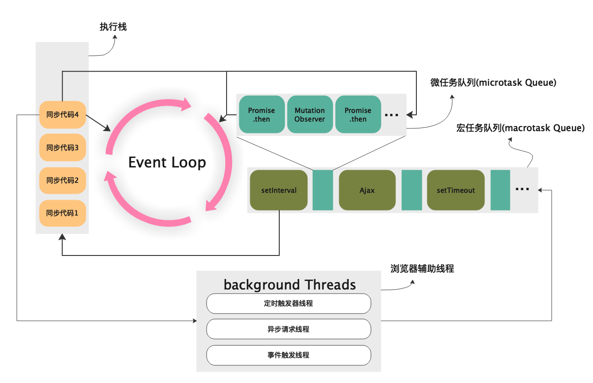
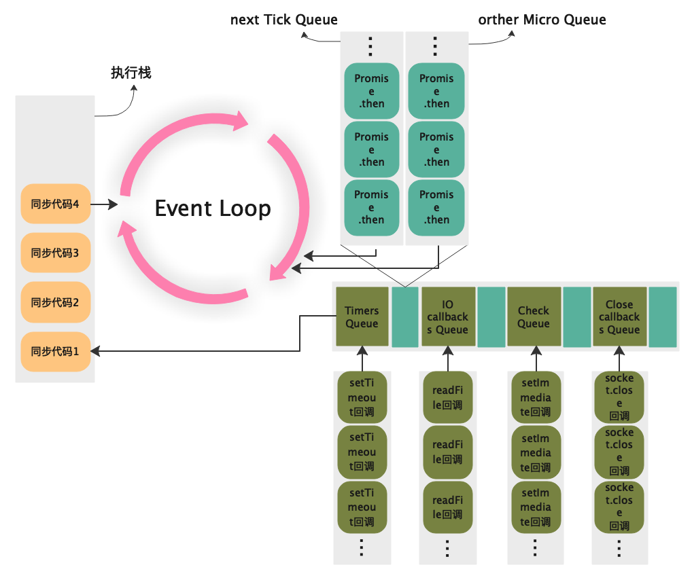

# 事件循环机制

## 什么是事件循环机制（`EventLoop`）

它是一个在`JavaScript引擎`等待任务，执行任务和进入休眠状态等待更多任务这几个状态之间转换的无限循环。我们都知道`JavaScript引擎`是单线程的，至于为什么是单线程主要是出于`JavaScript`的使用场景考虑，作为浏览器的脚本语言，js 的主要任务是主要是实现用户与浏览器的交互，以及操作 dom，如果设计成多线程会增加复杂的同步问题。想象一个场景：多个线程同时操作 dom，浏览器渲染引擎该使用哪个线程的结果。当然为了利用多核 CPU 的计算能力，HTML5 提出`Web Worker`标准，允许 JavaScript 脚本创建多个线程，但是子线程完全受主线程控制，且不得操作 DOM。所以，这个新标准并没有改变 JavaScript 单线程的本质。

虽然 JS 是单线程的，但浏览器却是多线程，其中几个典型的线程已经在图中表示出来，而**`EventLoop`就是沟通`JS引擎线程`和`浏览器线程`的桥梁，也是浏览器实现异步非阻塞模型的关键**。

## 宏队列和微队列

宏队列，`macrotask`，也叫`tasks`。 一些异步任务的回调会依次进入宏任务队列（`macro task queue`），等待后续被调用，这些异步任务包括：

- `setTimeout`
- `setInterval`
- `setImmediate` (Node 独有)
- `requestAnimationFrame` (浏览器独有)
- `I/O`
- `UI rendering` (浏览器独有)

微队列，`microtask`，也叫`jobs`。 另一些异步任务的回调会依次进入微任务队列（`micro task queue`），等待后续被调用，这些异步任务包括：

- `process.nextTick` (Node 独有)
- `Promise`
- `Object.observe`
- `MutationObserver`

## 浏览器事件循环



### 浏览器 EventLoop 的具体流程：

1. `js引擎`将所有代码放入执行栈，并依次弹出并执行，这些任务有的是同步有的是异步(宏任务或微任务)。
2. 如果在执行 栈中代码时发现宏任务则交给浏览器相应的线程去处理，浏览器线程在正确的时机(比如定时器最短延迟时间)将宏任务的消息(或称之为回调函数)推入宏任务队列。而宏任务队列中的任务只有执行栈为空时才会执行。
3. 如果执行 栈中的代码时发现微任务则推入微任务队列，和宏任务队列一样，微任务队列的任务也在执行栈为空时才会执行，但是微任务始终比宏任务先执行。
4. 当执行栈为空时，`EventLoop`转到微任务队列处，依次弹出首个任务放入执行栈并执行，如果在执行的过程中又有微任务产生则推入队列末尾，这样循环直到微任务队列为空。
5. 当执行栈和微任务队列都为空时，`EventLoop`转到宏任务队列处，并取出队首的任务放入执行栈执行。需要注意的是宏任务每次循环只执行一个。
6. **重复 1-5 过程**。
7. ...直到栈和队列都为空时，代码执行结束。引擎休眠等待直至下次任务出现。

### 在这个过程中有三个重点：

1. 宏任务每次只取一个，执行之后马上执行微任务。
2. 微任务会依次执行，直到微任务队列为空。
3. 图中没有画`UI rendering`的节点，因为这个是由浏览器自行判断决定的，但是只要执行`UI rendering`，它的节点是在执行完所有的微任务（`microtask`）之后，下一个宏任务（`macrotask`）之前，紧跟着执行`UI render`。

看到这里相信任何事件循环判断的题都难不倒你了，做个小测试检验一下吧：

```js
console.log(1);

setTimeout(() => {
  console.log(2);
  Promise.resolve().then(() => {
    console.log(3);
  });
});

new Promise((resolve, reject) => {
  console.log(4);
  resolve(5);
}).then((data) => {
  console.log(data);

  Promise.resolve()
    .then(() => {
      console.log(6);
    })
    .then(() => {
      console.log(7);

      setTimeout(() => {
        console.log(8);
      }, 0);
    });
});
setTimeout(() => {
  console.log(9);
}, 0);
console.log(10);
```

答案：**1，4，10，5，6，7，2，3，9，8**。你做对了吗？ 如果还不明白的话对照图在走一次。

## Node.JS 事件循环



可以看出 Node.JS 的事件循环比浏览器端复杂很多。

### NodeJS 中的宏队列和微队列

事实上 NodeJS 中执行宏队列的回调任务有**6 个阶段**，按如下方式依次执行：

1. **timers 阶段**：这个阶段执行`setTimeout`和`setInterval`预定的`callback`。
2. **I/O callback 阶段**：执行除了`close`事件的`callbacks`、被`timers`设定的`callbacks`、`setImmediate()`设定的`callbacks`、这些之外的 `callbacks`。
3. **idle, prepare 阶段**：仅 node 内部使用。
4. **poll 阶段**：获取新的`I/O事件`，适当的条件下 node 将阻塞在这里。
5. **check 阶段**：执行`setImmediate()`设定的`callbacks`。
6. **close callbacks 阶段**：执行`socket.on('close', ....)`这些`callbacks`。

其中宏队列有 4 个，各种类型的任务主要集中在以下四个队列之中：

1. `Timers Queue`
2. `IO Callbacks Queue`
3. `Check Queue`
4. `Close Callbacks Queue`

微队列主要有 2 个，不同的微任务放在不同的微队列中：

1. `Next Tick Queue`：是放置`process.nextTick(callback)`的回调任务的。
2. `Other Micro Queue`：放置其他`microtask`，比如`Promise`等。

### Node EventLoop 的具体流程：

1. 执行全局`Script`的同步代码。
2. 执行`microtask`微任务，先执行所有`Next Tick Queue`中的所有任务，再执行`Other Microtask Queue`中的所有任务。
3. 执行`macrotask`宏任务，共 6 个阶段，从第 1 个阶段开始执行相应每一个阶段`macrotask`中的所有任务，注意，这里是所有每个阶段宏任务队列的所有任务，在浏览器的`Event Loop`中是只取宏队列的第一个任务出来执行，每一个阶段的`macrotask`任务执行完毕后，开始执行微任务，也就是步骤 2。
4. `Timers Queue` -> 步骤 2 -> `I/O Queue` -> 步骤 2 -> `Check Queue` -> 步骤 2 -> `Close Callback Queue` -> 步骤 2 -> `Timers Queue` ......。
5. **重复 1 - 4 过程**。

下面做一个小测试吧：

```js
console.log(0);

setTimeout(() => {
  // callback1
  console.log(1);
  setTimeout(() => {
    // callback2
    console.log(2);
  }, 0);
  setImmediate(() => {
    // callback3
    console.log(3);
  });
  process.nextTick(() => {
    // callback4
    console.log(4);
  });
}, 0);

setImmediate(() => {
  // callback5
  console.log(5);
  process.nextTick(() => {
    // callback6
    console.log(6);
  });
});

setTimeout(() => {
  // callback7
  console.log(7);
  process.nextTick(() => {
    // callback8
    console.log(8);
  });
}, 0);

process.nextTick(() => {
  // callback9
  console.log(9);
});

console.log(10);
```

答案：**0, 10, 9, 1, 4, 7, 8, 5, 6, 3, 2**。

## 总结

1. 事件循环是浏览器和 Node 执行 JS 代码的核心机制，但浏览器事件循环和 NodeJS 事件循环的实现机制有些不同。
2. 浏览器事件循环有一个宏队列，一个微队列，且微队列在执行过程中一个接一个执行一直到队列为空，宏队列只取队首的一个任务放入执行栈执行，执行过后接着执行微队列，并构成循环。
3. NodeJS 事件循环有四个宏队列，两个微队列，微队列执行方式和浏览器的类似，先执行`Next Tick Queue`所有任务，再执行`Other Microtask Queue`所有任务。但宏队列执行时会依次执行队列中的每个任务直至队为空才开始再次执行微队列任务。
4. `macrotask`包括：`setTimeout`、`setInterval`、`setImmediate(Node)`、`requestAnimation(浏览器)`、`IO`、`UI rendering`。
5. `microtask`包括：`process.nextTick(Node)`、`Promise`、`Object.observe`、`MutationObserver`。

## `setTimeout`和`Promise`和`async await`

`setTimeout`属于宏任务。\
`Promise`本身是同步的，但在执行`resolve`或者`reject`时是异步的，即里面的`then`方法是异步的，属于微任务。\
`async/await`中`await`后面紧跟的表达式是同步的，但接下来的代码是异步的，属于微任务。
