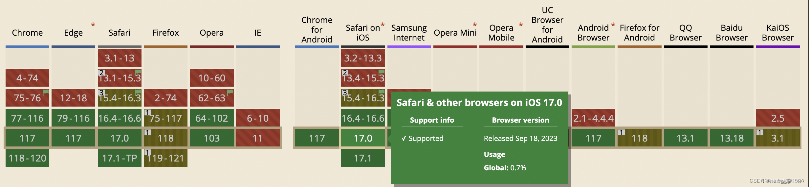
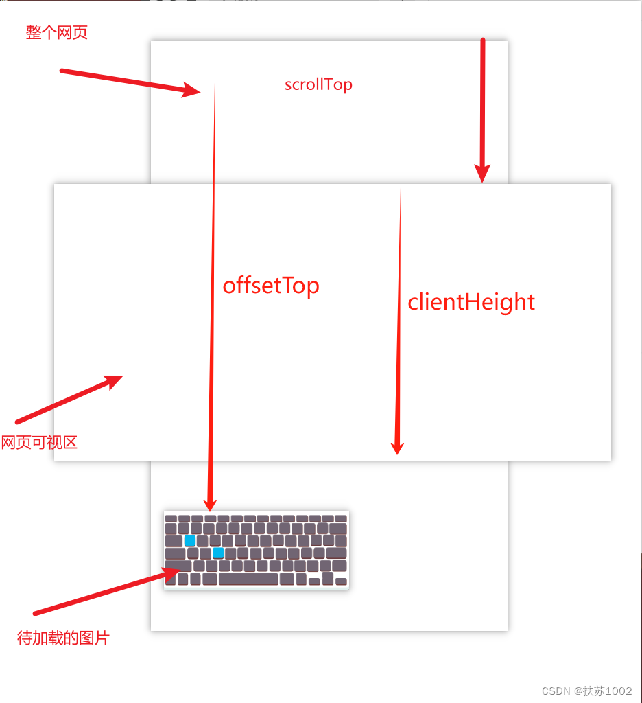
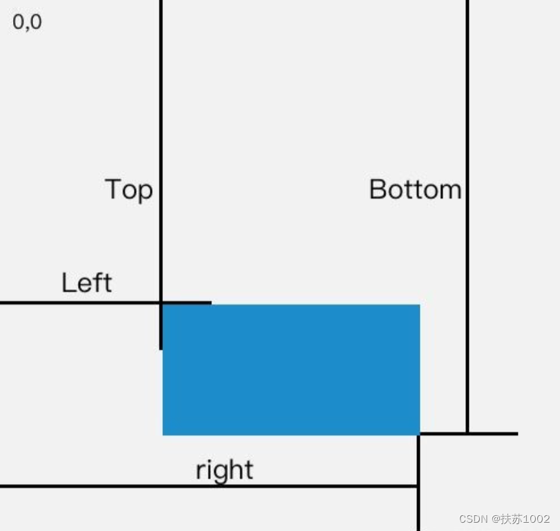

# 图片懒加载

## 懒加载是什么

延迟加载，对于一个很长的页面，优先加载可视区域的内容，其他部分等进入可视区域时再加载。

## 为什么要懒加载（优点）

懒加载是一种网页性能优化的方式，它能极大的提升用户体验。比如一个页面中有很多图片，但是首屏只出现几张，这时如果一次性把图片全部加载出来会影响性能。这时可以使用懒加载，页面滚动到可视区再加载。优化首屏加载。

> 总结出来就两个点：
>
> 1. 部加载的话会影响用户体验。
> 2. 浪费用户的流量，有些用户并不想全部看完，全部加载会耗费大量流量。

懒加载优点： 页面加载速度快，减轻服务器压力，节约流量，用户体验好。

## 图片懒加载实现方式

图像是页面的一部分，它会提前开始加载。一旦浏览器在源代码中看到它们，就会提示下载。即使图像被隐藏，即使它位于一个非常长的页面的底部，也会提前加载。

### 设置`img`标签`loading="lazy"`

设置`loading="lazy"`允许浏览器，延迟加载屏幕外图像`img`和`iframe`，直到用户滚动到它们附近。

> `loading`属性支持下面这几个值：
>
> - `lazy`：图片或框架懒加载，也就是元素资源快要被看到的时候加载。
> - `eager`：图片或框架无视一切进行加载。
> - `auto`：默认值。图片或框架基于浏览器自己的策略进行加载。\
>   如果`HTMLImageElement`或者`HTMLIFrameElement`元素没有显式地设置`loading`属性或者`loading`属性的值不合法，则都被当作`“auto”`处理。

```html
 <iframe src="" loading="lazy" />
```

- `Lazy loading`加载数量与屏幕高度有关，高度越小加载数量越少，但并不是线性关系。
- `Lazy loading`加载数量与网速有关，网速越慢，加载数量越多，但并不是线性关系。
- 滚动即会触发图片懒加载，不会说滚动一屏后再去加载。
- 窗口`resize`尺寸变化也会触发图片懒加载，当屏幕高度从小变大的时候。

`loading`属性的兼容性：



判断当前浏览器是否支持`loading="lazy"`：

1. `var isSupportLoading = 'loading' in document.createElement('img');`。
2. `var isSupportLoading = 'loading' in new Image();`。
3. `var isSupportLoading = 'loading' in HTMLImageElement.prototype;`。

获取`loading`属性值：

```js
var attrLoading = img.loading;
// 如果浏览器并不支持原生的loading懒加载，则会返回undefined，例如在Firefox浏览器下
```

### 用`js`监测

实现原理：

监听`scroll`事件，获取`img`元素相对于视口的顶点位置`el.getBoundingClientRect().top`，只要这个值小于浏览器的高度`window.innerHeight`就说明进入可视区域，当图片进入可视区域时再去加载图片资源。

图片刚开始显示的是默认图片，当进入可视区域时，用`data-src`的真实图片地址赋值给`src`。

实现方案：

1. 首先给图片一个占位资源：
   ```html
   
   ```
2. `clientHeight`、`scrollTop`和`offsetTop`：
   
3. 接着，通过监听`scroll`事件来判断图片是否到达视口：

   ```js
   let img = document.getElementsByTagName("img");
   let num = img.length;
   let count = 0; //存储图片加载到的位置，避免每次都从第一张图片开始遍历

   lazyload(); // 首次加载别忘了显示图片

   window.addEventListener("scroll", throttle(lazyload, 200)); // throttle是节流函数，自己实现一下

   //offsetTop是元素与offsetParent的距离，循环获取直到页面顶部
   function getTop(el) {
     var T = el.offsetTop;
     while ((el = el.offsetParent)) {
       T += el.offsetTop;
     }
     return T;
   }

   function lazyload() {
     let viewHeight =
       document.documentElement.clientHeight || document.body.clientHeight; //视口高度
     let scrollTop =
       document.documentElement.scrollTop || document.body.scrollTop; //滚动条卷去的高度
     for (let i = count; i < num; i++) {
       // 元素现在已经出现在视口中
       if (getTop(img[i]) < scrollTop + viewHeight) {
         if (img[i].getAttribute("src") !== "default.jpg") continue;
         img[i].src = img[i].getAttribute("data-src");
         count++;
       } else {
         break; // 提早退出
       }
     }
   }
   ```

   > `offsetParent`就是距离该子元素最近的进行过定位的父元素（`position：absolute relative fixed`），如果其父元素中不存在定位则`offsetParent`为：`body元素`。

### `getBoundingClientRect`

`getBoundingClientRect`方法返回元素相对视口左上角的偏移量以及元素本身长宽，单位：`px`。



上述的`lazyload`函数改成下面这样：

```js
function lazyload() {
  let viewHeight =
    document.documentElement.clientHeight || document.body.clientHeight;
  for (let i = count; i < num; i++) {
    // 元素现在已经出现在视口中
    if (img[i].getBoundingClientRect().top < viewHeight) {
      if (img[i].getAttribute("src") !== "default.jpg") continue;
      img[i].src = img[i].getAttribute("data-src");
      count++;
    } else {
      break;
    }
  }
}
```

### `IntersectionObserver`

有兼容性问题。

这是浏览器内置的一个`API`，实现了监听`window`的`scroll`事件、判断是否在视口中以及节流三大功能。

```js
let img = document.getElementsByTagName("img");

const observer = new IntersectionObserver((changes) => {
  //changes 是被观察的元素集合
  for (let i = 0, len = changes.length; i < len; i++) {
    let change = changes[i];
    // 通过这个属性判断是否在视口中
    if (change.isIntersecting) {
      const imgElement = change.target;
      imgElement.src = imgElement.getAttribute("data-src");
      observer.unobserve(imgElement);
    }
  }
});
Array.from(img).forEach((item) => observer.observe(item));
```

这样就很方便地实现了图片懒加载，当然这个`IntersectionObserver`也可以用作其他资源的预加载，功能非常强大。
