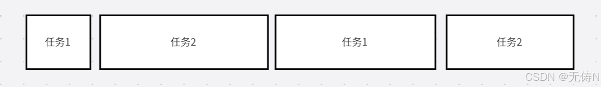
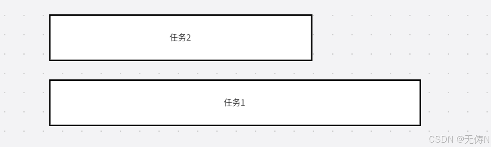

# 并发、并行、异步、同步

## 并发、并行

并发：对于单核处理器来说，计算机通过分配时间片的形式，让一个任务执行一段时间后执行另一个任务，不同任务会交替往复的进行。（这个过程也被称为进程或者线程的上下文切换）。

并行：对于多核处理器来说，计算机能够在不同的核心上并行的执行任务。

## 异步、同步

同步和异步是两种不同的编程方式。

同步：必须在前一个任务完成之后，才能执行下一个任务，所以在同步中没有并发和并行的概念。

异步：不同的任务之间不会相互等待，在执行任务 1 时可以同时执行任务 2，可通过多线程编程实现，每个线程会被分配到不同的核心上执行，实现真正的并行。但如果计算机为单核处理器，操作系统则会通过分配时间片的方式并发执行这些线程。

## js 单线程异步编程

异步编程：允许我们在执行一个长时间任务时，程序不需要进行等待，而是继续执行之后的代码，直到这个任务完成之后在通知你，形式通常为回调函数。

js 是没有多线程概念的，但是可以通过函数回调机制实现单线程的并发，当回调函数需要被执行时，会先执行回调函数，通过这种异步编程的方式实现单线程的并发。

优点：避免程序阻塞，提高 CPU 的执行效率。

对于 I/O 密集的程序（WEB 应用）会经常执行网络操作数据库访问，这类应用适合异步编程。如果用多线程容易浪费资源，因为每个线程的大多数时间都是在等待 I/O 操作，线程自身也会占用内存，线程的切换也有额外开销，线程之间还有资源竞争问题。

多线程编程适合于计算量密集的应用（视频图像处理，科学计算），尽可能让每一个核心发挥最大功效。
