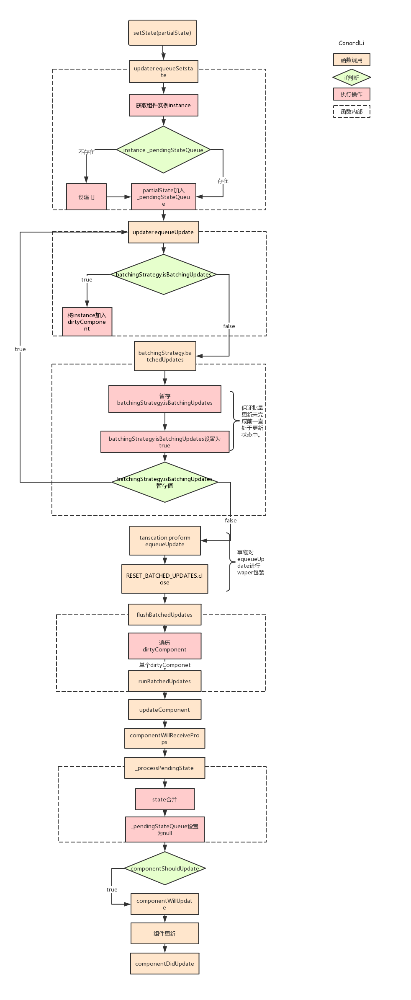

# `setState`过程

`setState`之后发生了什么？

**简单版本：**
`react`利用状态队列机制实现了`setState`的“异步”更新，避免频繁的重复更新`state`。

首先将新的`state`合并到状态更新队列中，然后根据更新队列和`shouldComponentUpdate`的状态来判断是否需要更新组件。

**复杂版本：**

- `enqueueSetState`将`state`放入队列中，并调用`enqueueUpdate`处理要更新的`Component`
- 如果组件当前正处于`update`事务中，则先将`Component`存入`dirtyComponent`中。否则调用`batchedUpdates`处理。
- `batchedUpdates`发起一次`transaction.perform()`事务
- 开始执行事务初始化，运行，结束三个阶段
  - 初始化：事务初始化阶段没有注册方法，故无方法要执行
  - 运行：执行`setSate`时传入的`callback`方法
  - 结束：更新`isBatchingUpdates`为`false`，并执行`FLUSH_BATCHED_UPDATES`这个`wrapper`中的`close`方法`FLUSH_BATCHED_UPDATES`在`close`阶段，会循环遍历所有的`dirtyComponents`，调用`updateComponent`刷新组件，并执行它的`pendingCallbacks`, 也就是`setState`中设置的`callback`。

[参考文章](https://juejin.cn/post/6844903781813993486#heading-9)

1. 将`setState`传入的`partialState`参数存储在当前组件实例的`state`暂存队列中。
2. 判断当前`React`是否处于批量更新状态，如果是，将当前组件加入待更新的组件队列中。
3. 如果未处于批量更新状态，将批量更新状态标识设置为`true`，用事务再次调用前一步方法，保证当前组件加入到了待更新组件队列中。
4. 调用事务的`waper`方法，遍历待更新组件队列依次执行更新。
5. 执行生命周期`componentWillReceiveProps`。
6. 将组件的`state`与暂存队列中的`state`进行合并，获得最终要更新的`state`对象，并将队列置为空。
7. 执行生命周期`componentShouldUpdate`，根据返回值判断是否要继续更新。
8. 执行生命周期`componentWillUpdate`。
9. 执行真正的更新，`render`。
10. 执行生命周期`componentDidUpdate`。

