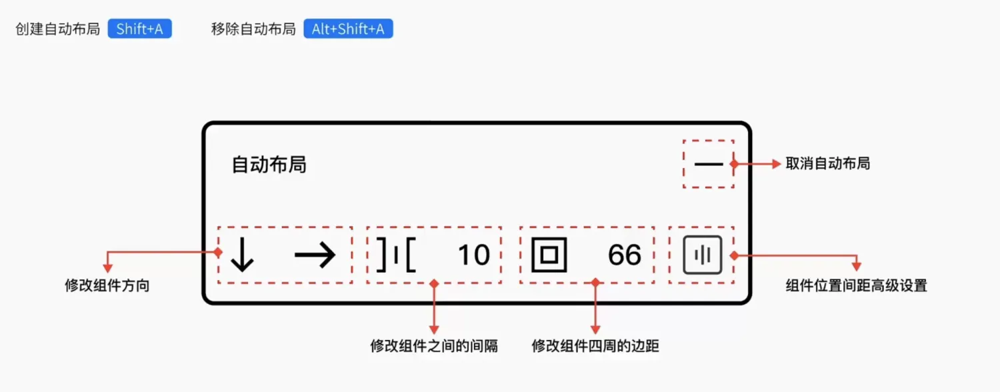
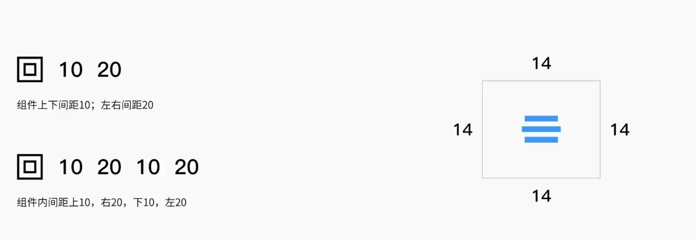

# `figma`

## 使用方法

- 方法一：使用`web`端。

  1. 打开[`Figma`官网](https://www.figma.com/)。
  2. 注册并登录账号即可。
  3. 如果你想在浏览器中使用自己的本地字体，那么需要下载`Figma`的`Font installers`。

- 方法二：使用客户端。[下载链接](https://www.figma.com/downloads/)

  1. 为了更好的体验，你可以下载`Figma`桌面客户端。
  2. 采用此方案的话可以不需要安装`Font installers`。

## 实时预览方案

1. 移动端设备使用`Figma Mirror APP`。
2. 网页端浏览器输入`figma.com/mirror`。

> 注：移动端需要手机和电脑同一个网络，并且登录同一个账户。

## 视图操作

1. 按住`空格`或者`中键滚轮`可以移动画布。
2. 缩放画布按`Ctrl + 中键滚轮`，百分百显示画面`Shift + 0`。
3. 显示所有画布，按`Shift + 1`。
4. 隐藏左右两侧面板`Ctrl + \`。

## 移动工具

1. 用来选中和移动元素，快捷键`V`。
2. 按住`Alt`拖动复制元素，`Ctrl + D`可以重复复制。
3. 可以修改形状的圆角，按`Alt`点击小圆点可以单独控制圆角。
4. 框选所有元素，可以使用整理功能，方便对间距进行整体控制。

## 缩放工具

1. 用来缩放多个元素不会变形，快捷键`K`。
2. 圆角使用移动工具缩放后会变形，借助缩放工具即可。

## 组

1. 编组快捷键`Ctrl + G`，取消编组`Ctrl + Shift + G`。
2. 配合移动工具按`Shift`为加选，再按为减选。
3. 当子元素调整边界或移动位置时，组的边界会自动调整。
4. 组相当于批量移动工具，不具备高级属性。

什么情况下使用组？

1. 你希望对整个组调整大小的同时也能够影响子集的大小缩放。
2. 你想对多个元素进行位置的移动。

## 画框/`Frame`

1. 添加画框快捷键`Ctrl + Alt + G`，取消画框`Ctrl + Shift + G`。
2. 右侧属性栏中可以切换两种状态（组和画框）。
3. 勾选裁剪内容后，超出轮廓框的内容将不再显示。
4. 弹性布局必备，子元素能够在父级`frame`变化时保持自身相对位置和大小。
5. 强制嵌套快捷键移动时按`Ctrl`，如不需要嵌套移动时按`空格`。

什么情况下使用`Frame`?

1. 你的项目需要用到弹性布局/自适应。
2. 你想对超出范围的内容部分进行裁切。
3. 具备多个画框进行嵌套。

## 形状工具

1. 编辑形状可以双击或者点击工具栏上方的编辑对象。
2. 使用移动工具可以在编辑模式下对单独点进行圆角修改。
3. 布尔运算使用方法和其他设计软件一样，合并形状快捷键`Ctrl + E`。

## 蒙版工具

1. 上层为图像，下层为遮罩，创建蒙版快捷键`Ctrl + Alt + M`，再按一次是取消。
2. 功能更像是对图像进行裁切，便捷操作为可以使用`Frame`或者放置图片功能`Ctrl + Shift + K`。

## 钢笔工具

1. 钢笔快捷键`P`。
2. 路径线绘制完毕后按`ESC`断线。
3. 弯曲点快捷键按`Ctrl`点击锚点。
4. 使用钢笔工具在路径线上可以直接添加点，按`Alt`进行减点。
5. `Figma`中点与点之间会进行连接，从而构成一个完整的图形。
6. 双击绘制完的闭合路径线，可以使用颜料桶直接进行上色。

## 文字工具

1. 文字快捷键`T`。
2. `Figma`属性栏数值调整区域都可以按`Alt`结合鼠标左键进行调整。
3. 直接复制文字会把文字属性一并复制过去，通过`复制为文本`解决此问题。
4. 复制属性快捷键`Ctrl + Alt + C`粘贴属性快捷键`Ctrl + Alt + V`。
5. 可通过保存文本样式进行复用或者推送给团队使用。
6. 网页链接可以在文字上直接粘贴，就可以快速制作跳转链接。

## 预览以及分享

1. 草稿中的文件可以分享和编辑，对方可以保存。
2. 只有付费团队中的项目可以设置不让对方保存。
3. 在画板上右键可以设置不让对方保存。
4. 通过评论功能进行团队之间的沟通。

## 对齐、平均分布

1. 顶对齐`Alt + W`。
2. 底对齐`Alt + S`。
3. 左对齐`Alt + A`。
4. 右对齐`Alt + D`。
5. 水平居中`Alt + H`。
6. 垂直居中`Alt + V`。
7. 水平翻转`Shift + H`。
8. 垂直翻转`Shift + V`。

## 常用插件推荐

1. [Chinese Font Picker](https://www.figma.com/community/plugin/851126455550003999/Chinese-Font-Picker)中文字体选择器。
2. [Unsplash](https://www.figma.com/community/plugin/738454987945972471/Unsplash)丰富的可商用图片资源。
3. [UI Faces](https://www.figma.com/community/plugin/769664006254845172/UI-Faces)生成用户头像。
4. [Icons8 Icons](https://www.figma.com/community/plugin/791103617505812222/Icons8-%E2%80%94-icons%2C-illustrations%2C-photos)图标资源库。
5. [Heron handoff](https://www.figma.com/community/plugin/830051293378016221/Heron-Handoff)切图标注交接。
6. [SmoothShadow](https://www.figma.com/community/plugin/788830704169694737/SmoothShadow)阴影调整器。
7. [Find and Replace](https://www.figma.com/community/plugin/735072959812183643/Find-and-Replace)文本替换。
8. [Chinese User Data Generator](https://www.figma.com/community/plugin/864052338727969891/Chinese-User-Data-Generator)中文用户数据生成器。
9. `Mockup`。

## 图层

1. 上移一层`Ctrl + ]`。
2. 下移一层`Ctrl + [`。
3. 移到顶层`Ctrl + Shift + ]`。
4. 移到底层`Ctrl + Shift + [`。

## 组件管理

1. 添加组件快捷键`Ctrl + Alt + K`。
2. 组件分为初始组件和实例组件（复制初始组件得到的）。
3. 修改初始组件会直接影响实例组件，如不需要影响，对实例组件进行分离实例即可`Ctrl + Alt + B`。
4. 项目中具有多种属性状态的组件，使用变体功能进行搭建。
5. 操作变体组件时，对命名规则要求较高，特别注意。
6. 重命名快捷键`Ctrl + R`。

## 组件库调用

资产：开关打开。

## 约束工具

1. 约束常用于适合弹性布局的界面中。
2. 当父级画框进行大小拖动时，只会影响子级，不能跨级控制。
3. 按`Shift`可以加选与减选约束控制。

## 栅格工具

1. 栅格工具可以应用在`UI（4/6）`以及网页设计中`（12/24）`。
2. 需要弹性布局就选择“拉伸”模式，其余情况选择“左”“右”“居中”。
3. 栅格支持保存样式。

## 自动布局

1. 需要有一个大图层管理里面的小图层。
2. 适应内容：根据文字数量变化自动调节。
3. 固定宽度：组件的宽度和高度固定。
4. 填充容器：根据外轮廓的大小变化，内部元素大小也随之改变。

## 磨砂图标绘制技法

1. 绘制造型。
2. 添加颜色、描边（描边设置为叠加属性）。
3. 添加渐变、背景模糊（背景模糊时需要将背景色透明度降低）。

## 微质感图标技法

1. 造型绘制。
2. 颜色添加。
3. 阴影、内阴影添加（1 个外阴影，2 个内阴影，其中一个内阴影颜色偏亮，另一个内阴影的颜色跟环境色匹配）。

## 螺旋图标的绘制

借助插件（`Rotate Copies`）高效完成复制操作。

## 2.5D 图标绘制

使用插件（`easometric`）巧妙绘制轴测图标。

复杂的`2.5D`图标不建议使用`figma`绘制。

## 项目实战

学习路径

1. 项目框架搭建
2. 页面制作流程
3. 设计规范整理
4. 数据填充操作
5. 交互原型制作
6. 工作交接方式

常见项目框架搭建

- 画板左右两边留固定边距的方法：
  1.  使用标尺`Shift + R`。
  2.  使用网格布局。

标签栏搭建

组件化，合为变体可以节省时间。
