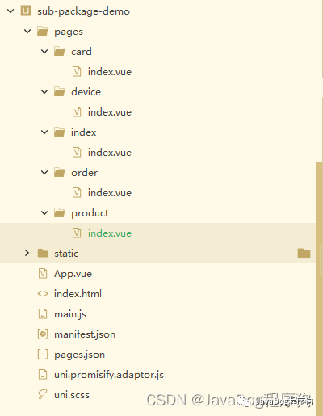
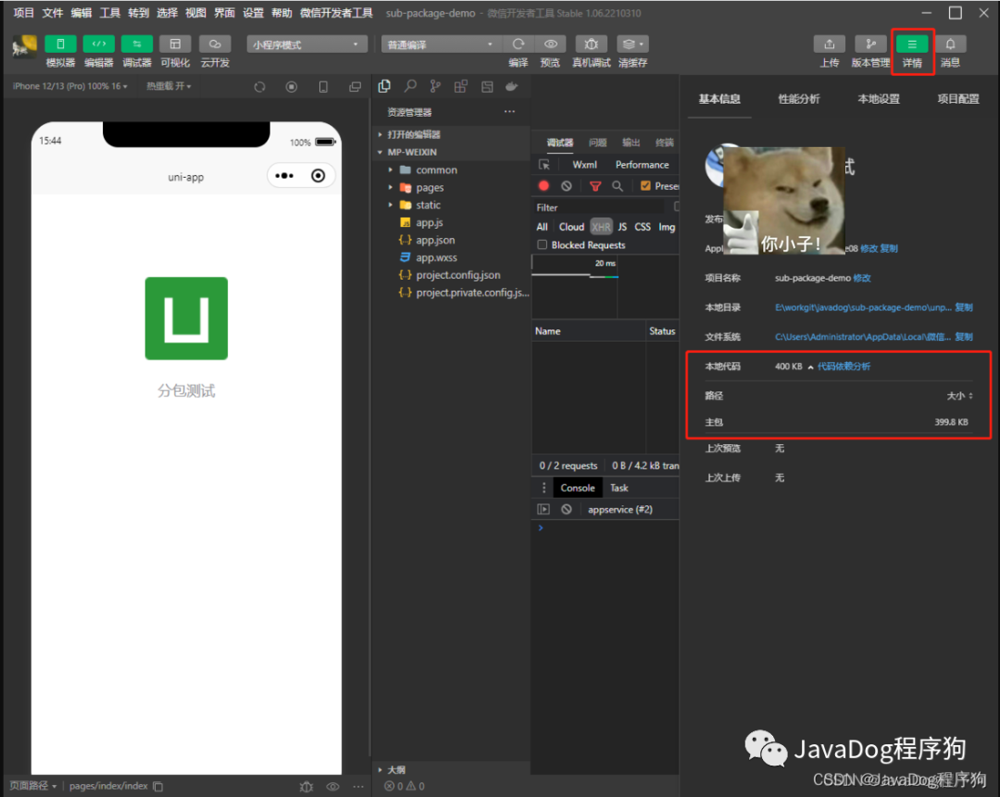
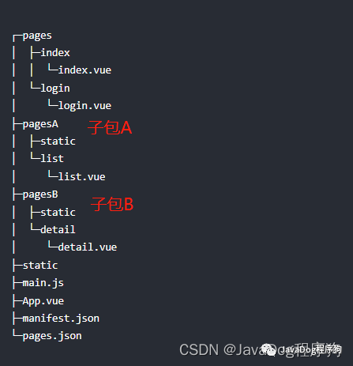
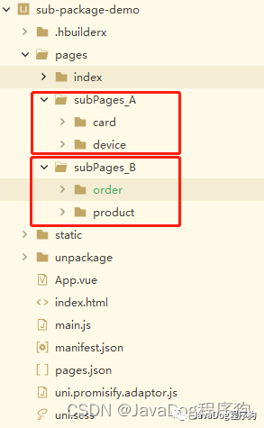
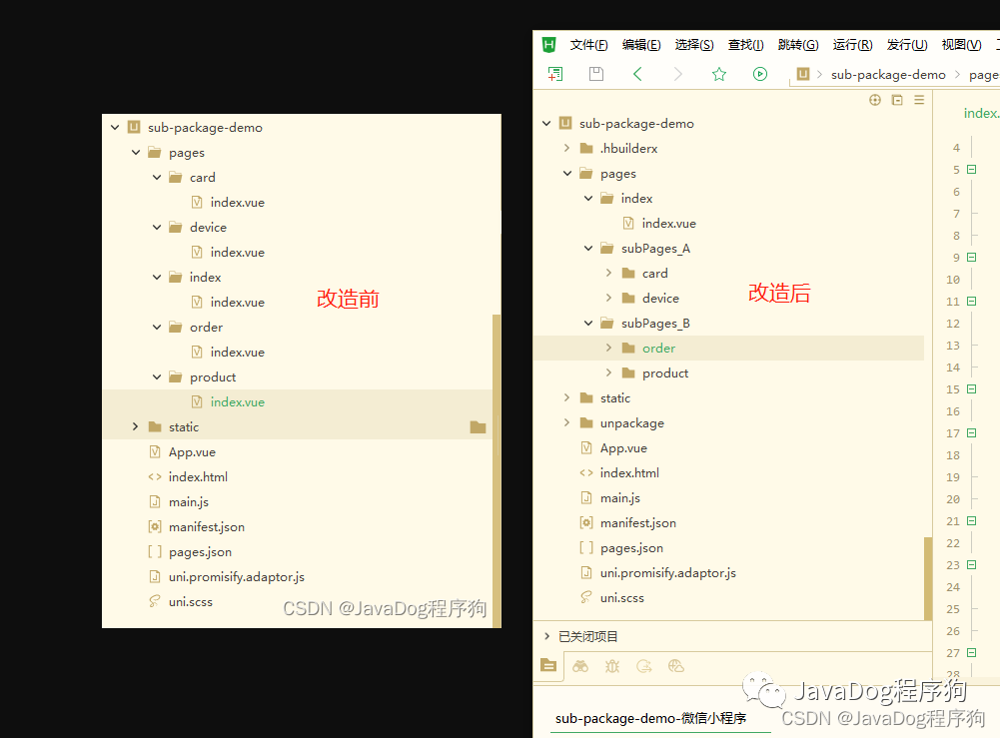
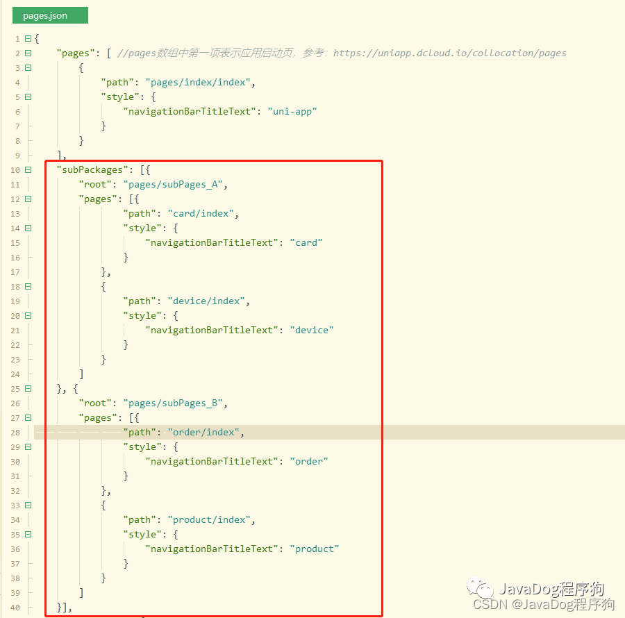
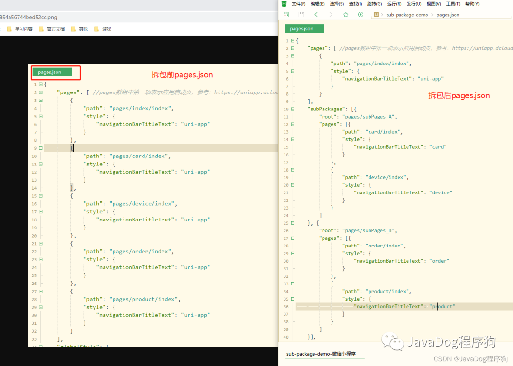
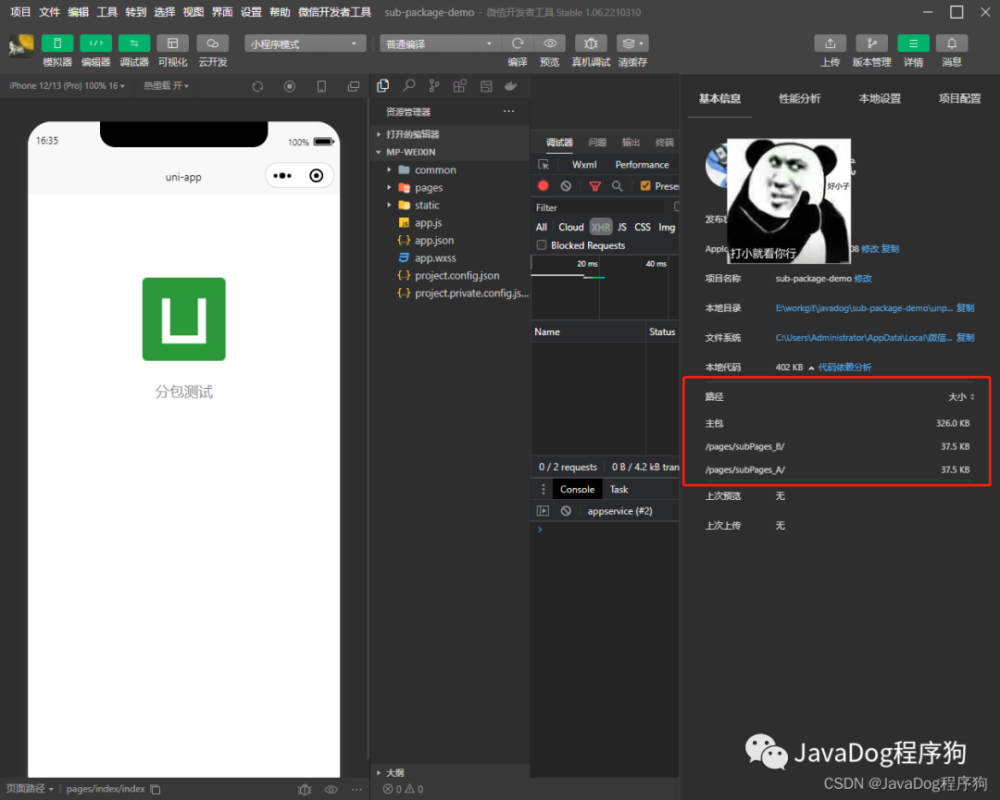
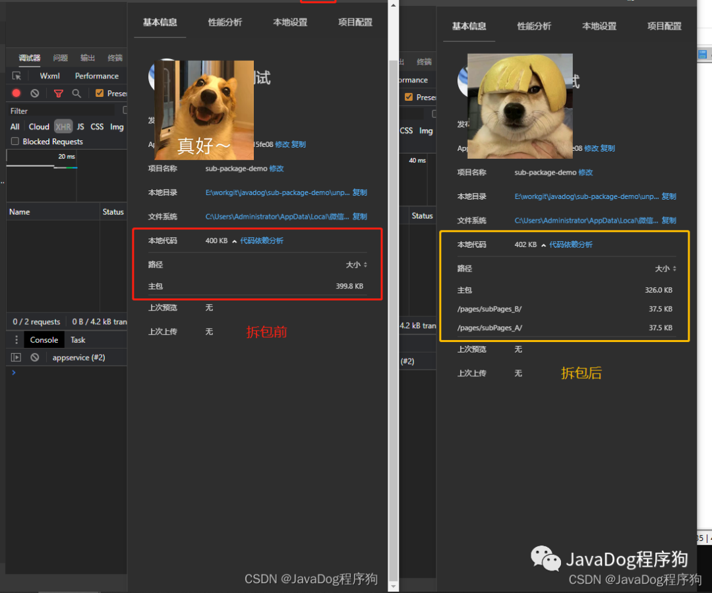

# 小程序分包

## 为什么小程序会有`2M`的限制

1. 用户体验：小程序要求在用户进入小程序前能够快速加载，以提供良好的用户体验。限制小程序的体积可以确保小程序能够在较短的时间内下载和启动，避免用户长时间的等待。
2. 网络条件：考虑到不同地区和网络条件的差异，限制小程序的体积可以确保在低速网络环境下也能够较快地加载和打开小程序，提供更广泛的用户覆盖。
3. 设备存储：一些用户使用的设备可能存储空间有限，限制小程序的体积可以确保小程序可以在这些设备上正常安装和运行。

## 如何解决包过大问题

1. 优化代码，删除掉不用的代码。
2. 图片压缩或者上传服务器。
3. 分包加载。

## 什么是分包加载

小程序一般都是由某几个功能组成，通常这几个功能之间是独立的，但会依赖一些公共的逻辑，且这些功能一般会对应某几个独立的页面。那么小程序代码的打包，可以按照功能的划分，拆分成几个分包，当需要用到某个功能时，才加载这个功能对应的分包。

## 实操分包步骤

1. 查看项目结构。\
    通过上方三个问题，我们开始具体分包流程，首先看一下`分包前项目结构`及`pages.json配置文件`。\
    
   ```json
   pages.json
   {
       "pages": [ //pages数组中第一项表示应用启动页，参考：https://uniapp.dcloud.io/collocation/pages
           {
               "path": "pages/index/index",
               "style": {
                   "navigationBarTitleText": "uni-app"
               }
           },
           {
               "path": "pages/card/index",
               "style": {
                   "navigationBarTitleText": "uni-app"
               }
           },
           {
               "path": "pages/device/index",
               "style": {
                   "navigationBarTitleText": "uni-app"
               }
           },
           {
               "path": "pages/order/index",
               "style": {
                   "navigationBarTitleText": "uni-app"
               }
           },
           {
               "path": "pages/product/index",
               "style": {
                   "navigationBarTitleText": "uni-app"
               }
           }
       ],
       "globalStyle": {
           "navigationBarTextStyle": "black",
           "navigationBarTitleText": "uni-app",
           "navigationBarBackgroundColor": "#F8F8F8",
           "backgroundColor": "#F8F8F8"
       },
       "uniIdRouter": {}
   }
   ```
2. 分析主包大小。\
   微信开发者工具中，查看【详情】进行分析，此处本地代码只有一个主包大小 399.8KB。\
   
3. 参考文档。本文以`uniapp`为实操介绍案例。\
   [小程序官方文档](https://developers.weixin.qq.com/miniprogram/dev/framework/subpackages.html)\
   [uniapp 分包文档](https://uniapp.dcloud.net.cn/collocation/pages.html#subpackages)
4. 结构调整。\
   将咱们项目结构按照如下图所示进行拆分。\
   \
   新建`subPages_A`和`subPages_B`，将`pages`下不同页面移入进新增的两个包，此处`subPages_A`的名字只做示例，实际要按照标准命名！\
   \
   比较下之前项目结构，此处项目会报错，不用担心，稍后修改`pages.json`。\
   
5. 修改`pages.json`。\
    根据上一步拆分的包路径，进行配置文件的调整，此处`注意"subPackages"要和"pages"同级`。\
    
   ```json
   {
     "pages": [
       //pages数组中第一项表示应用启动页，参考：https://uniapp.dcloud.io/collocation/pages
       {
         "path": "pages/index/index",
         "style": {
           "navigationBarTitleText": "uni-app"
         }
       }
     ],
     "subPackages": [
       {
         "root": "pages/subPages_A",
         "pages": [
           {
             "path": "card/index",
             "style": {
               "navigationBarTitleText": "card"
             }
           },
           {
             "path": "device/index",
             "style": {
               "navigationBarTitleText": "device"
             }
           }
         ]
       },
       {
         "root": "pages/subPages_B",
         "pages": [
           {
             "path": "order/index",
             "style": {
               "navigationBarTitleText": "order"
             }
           },
           {
             "path": "product/index",
             "style": {
               "navigationBarTitleText": "product"
             }
           }
         ]
       }
     ],
     "globalStyle": {
       "navigationBarTextStyle": "black",
       "navigationBarTitleText": "uni-app",
       "navigationBarBackgroundColor": "#F8F8F8",
       "backgroundColor": "#F8F8F8"
     },
     "uniIdRouter": {}
   }
   ```
   这里的意思是将主包拆成`subPages_A`和`subPages_B`两个子包，对比下之前的配置。\
   
6. 启动测试。\
   启动后查看微信开发者工具，查看【详情】可看到`主包大小降为326.0kb`，并且下方还有`subPages_A`和`subPages_B`两个子包。\
   \
   比较之前包大小，分包成功！\
   
7. 特别注意。\
    如果涉及代码中路径问题，需要调成最新包结构路径。例如：\
    拆包前跳转到对应设备页面：\
   ```js
   uni.navigateTo({
     url: "/pages/device/index",
   });
   ```
   拆包后跳转到对应设备页面：\
   ```js
   uni.navigateTo({
     url: "/pages/subPages_A/device/index",
   });
   ```
