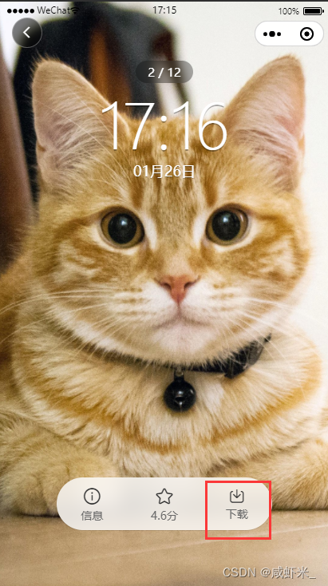
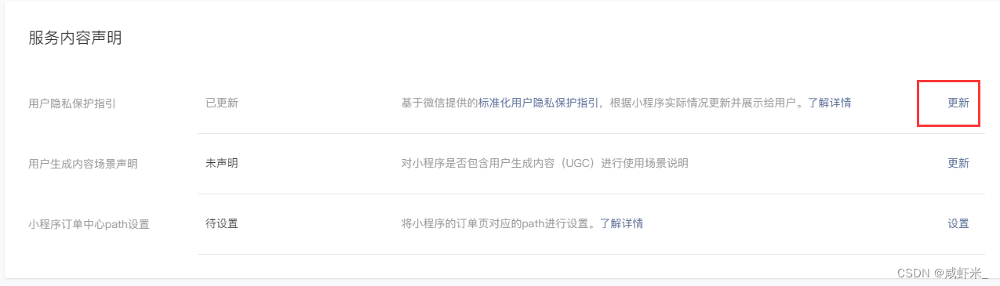
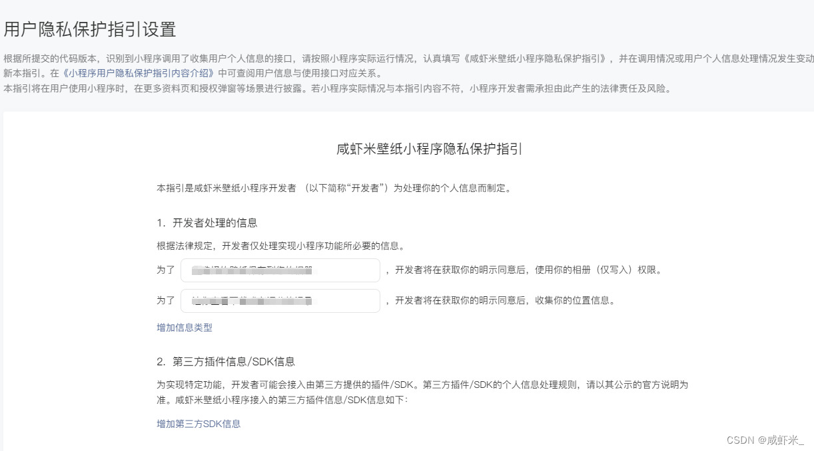

# 微信小程序保存图片到系统相册

> 在开发微信小程序的时候，经常能看到小程序里面有下载按钮，如何将小程序中的图片下载到手机相册中呢？下面给大家说一下怎么做，代码如何去写。



## 一、到微信小程序后台开启“用户隐私保护指引”

1. 进入小程序后台，侧栏拉到“设置”这一项，再找到“服务内容声明”，更新“用户隐私保护”，如下图所示：
   
2. 按照如下所示的指引填写即可
   
   注意：如果不更新隐私保护，是无法获取到存储权限的，这个必须要开启才行。

## 二、代码实现

### 使用 getImageInfo 获取图片临时地址

```js
// 点击下载
const clickDownload = async () => {
  try {
    uni.showLoading({
      title: "下载中...",
      mask: true,
    });
    let res = await downPushData();
    if (res.errCode != 0) throw res;
    // #ifdef MP || APP
    uni.getImageInfo({
      src: crtWallInfo.value.picurl,
      success: function (res) {
        var path = res.path;
        uni.saveImageToPhotosAlbum({
          filePath: path,
          success(res) {
            uni.hideLoading();
            uni.showToast({
              title: "保存成功，可去相册查看",
              icon: "none",
              duration: 2000,
            });
          },
          fail(err) {
            uni.hideLoading();
            if (err.errMsg == "saveImageToPhotosAlbum:fail cancel") {
              uni.showToast({
                title: "保存失败，请重新点击下载",
                icon: "none",
              });
              return;
            }
            uni.showModal({
              title: "提示",
              content: "需要您授权保存相册",
              showCancel: false,
              success: (res) => {
                if (res.confirm) {
                  uni.openSetting({
                    success(settingdata) {
                      if (settingdata.authSetting["scope.writePhotosAlbum"]) {
                        uni.showToast({
                          title: "获取权限成功",
                          icon: "none",
                        });
                      } else {
                        uni.showToast({
                          title: "获取权限失败",
                          icon: "none",
                        });
                      }
                    },
                  });
                }
              },
            });
          },
          complete(err) {},
        });
      },
    });
    // #endif

    // #ifdef H5
    // 调用预览图片的方法
    uni.previewImage({
      urls: [crtWallInfo.value.picurl],
      current: 0, // 点击图片传过来的下标
      success: (res) => {
        uni.showToast({
          title: "请长按保存",
          icon: "none",
          duration: 2000,
        });
      },
    });
    // #endif
  } catch (err) {
    console.log(err);
    uni.hideLoading();
  }
};
```

### 使用 downloadFile 获取图片临时地址

> 当对项目进行重构的时候，想要将图片资源变得小一点，所以在上传图片的时候均采用了 webp 格式的，这样就导致在预览页面下载图片的时候出错了，之前使用的是`getImageInfo()`这个 API，该 API 不支持 webp 图片格式获取临时地址，所以将`getImageInfo()`方法改成`downloadFile()`方法便可解决。

修改后代码

```js
// 点击下载
const clickDownload = async () => {
  if (!gotoLogin()) return;
  let { _id, classid } = currentInfo.value;

  // #ifdef H5
  let feedback = await showModal({ content: "请长按保存壁纸" });
  if (feedback == "confirm")
    actionCloudObj.writeDownload({ picid: _id, classid });
  // #endif

  // #ifndef H5
  try {
    uni.showLoading({
      title: "下载中...",
      mask: true,
    });
    uni.downloadFile({
      url: currentInfo.value.picurl,
      success: (res) => {
        console.log(res);
        uni.saveImageToPhotosAlbum({
          filePath: res.tempFilePath,
          success: (res) => {
            uni.showToast({
              title: "保存成功，请到相册查看",
              icon: "none",
            });
            actionCloudObj.writeDownload({ picid: _id, classid });
          },
          fail: (err) => {
            if (err.errMsg == "saveImageToPhotosAlbum:fail cancel") {
              uni.showToast({
                title: "保存失败，请重新点击下载",
                icon: "none",
              });
              return;
            }
            uni.showModal({
              title: "授权提示",
              content: "需要授权保存相册",
              success: (res) => {
                if (res.confirm) {
                  uni.openSetting({
                    success: (setting) => {
                      console.log(setting);
                      if (setting.authSetting["scope.writePhotosAlbum"]) {
                        uni.showToast({
                          title: "获取授权成功",
                          icon: "none",
                        });
                      } else {
                        uni.showToast({
                          title: "获取权限失败",
                          icon: "none",
                        });
                      }
                    },
                  });
                }
              },
            });
          },
          complete: () => {
            uni.hideLoading();
          },
        });
      },
      fail(err) {
        console.log(err);
      },
    });
  } catch (err) {
    console.log(err);
    uni.hideLoading();
  }
  // #endif
};
```

该方法同时也给`downloadFile()`增加了 fail 错误的执行方法，在之前代码中忘了加这个错误的返回值了，所以找了半天原因才知道`getImageInfo()`不支持 webp 格式。

注意：

`downloadFile()`该 API 传递的参数是 url，这个是服务器返回的地址，success 返回的临时地址，放在 tempFilePath 属性内，使用`saveImageToPhotosAlbum()`存入相册时，注意改一下`filePath=res.tempFilePath`。
