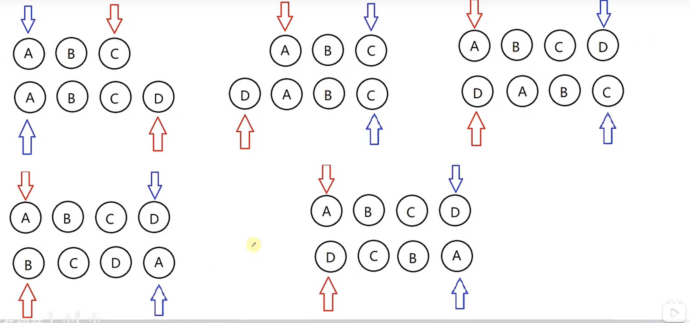

# 2025-19.vue 中 diff 算法原理

## diff 概念

vue 基于虚拟 DOM 做更新。diff 的核心就是比较两个虚拟节点的差异。vue 的 diff 算法是平级比较，不考虑跨级比较的情况。内部采用深度递归的方式 + 双指针的方式进行比较。

## diff 比较流程

1. 先比较是否是相同节点 key、tag
2. 相同节点比较属性，并复用老节点（将老的虚拟 DOM 复用给新的虚拟节点 DOM）
3. 比较儿子节点，考虑老节点和新节点儿子的情况
   - 老的没儿子，现在有儿子。直接插入新的儿子
   - 老的有儿子，新的没儿子。直接删除页面节点
   - 老的儿子是文本，新的儿子是文本，直接更新文本节点即可
   - 老的儿子是一个列表，新的儿子也是一个列表，updateChildren
4. 优化比较：头头、尾尾、头尾、尾头
5. 比对查找进行复用

> vue3 中采用最长递增子序列来实现 diff 优化。

