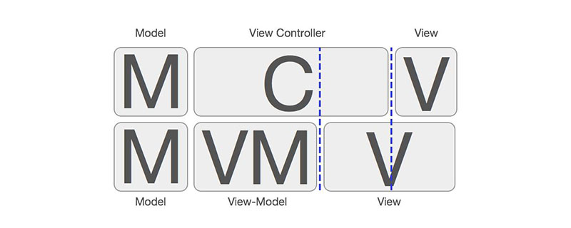
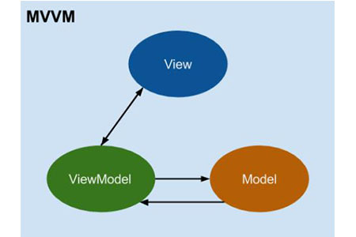
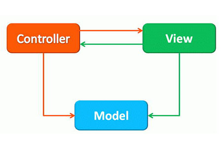

# `mvvm`和`mvc`

`mvvm`：`modle`可以触发视图更新，`view`可以更改数据，形成数据双向的绑定。`model`和`view`不直接进行交互，它们通过`viewmodel`进行交互。

- `model`：模型层（数据层：`vue`中的`data`数据）。
- `view`：视图层（dom ==> 在页面中展示的内容）。
- `viewmodel`：视图模型层（就是`vue`源码）。

`mvc`：`model`通知`view`进行页面更新，`view`接受用户行为通知`controller`，`controller`通知`model`进行数据更新，实现`model`和`view`的交互。

- `model`：模型层。
- `view`：视图层。
- `controller`：控制器。

1. `web1.0`时代：\
   文件全在一起，也就是前端和后端的代码全在一起。\
   问题：
   - 前端和后端都是一个人开发。（技术没有侧重点或者责任不够细分）
   - 项目不好维护。
   - `html`、`css`、`js`没有页面的静态内容，后端没办法工作。（没办法套数据）
2. `web2.0`时代：\
   `ajax`出现了，就可以：前端和后端数据分离了。\
   解决问题：后端不用等前端页面弄完，后端做后端的事情（写接口），前端做前端的事情（布局、特效、发送请求）。\
   问题：
   - `html`、`css`、`js`都在一个页面中，单个页面可能内容也是比较多的（也会出现不好维护的情况）。
3. 出现前端的`mvc`、`mvvm`：\
   解决问题：可以把一个特别大页面，进行拆分（组件化），单个组件进行维护。\
   什么是`mvvm`：`mvvm`是“`model、view、viewmodel`”的缩写。
