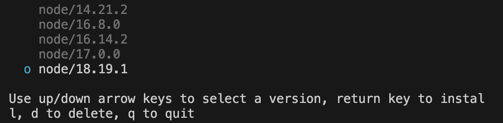

# `mac`下管理`node`多版本工具

`Mac`下使用`n`模块去安装多个指定版本的`Node.js`，并使用命令随时切换。

`node`中的`n`模块是，`node`专门用来管理`node`版本的模块，可以进行`node`版本的切换，下载，安装。

1. 安装`n`：

```bash
npm install -g n
```

2. 查看`n`模块的版本：

```bash
n --version
```

3. 展示当前安装的所有版本：

```bash
n list
```

4. 安装指定版本：

```bash
n 18.19.1
```

5. 安装最新版本：

```bash
n latest
```

6. 安装稳定版本：

```bash
n stable
```

7. 删除指定版本：

```bash
n rm 18.19.1
```

8. 切换当前`node`版本：

```bash
n
```

输入`n`，会出现如下选项，上下键选中要切换的`node`版本，然后回车即可。



9. 查看当前`node`版本：

```bash
node -v
```

10. 注意问题：
    - 问题 1：使用`n`切换了`node`版本，提示切换成功，但是使用`node -v`查看`node`版本发现还是旧的版本，检查是否已经下载过`node`。
      解决：先把之前安装的`node`全部卸载掉，再使用`n`安装并管理`node`。
    - 问题 2：使用`n`相关命令，如果报错权限不足，需要在命令前加上`sudo`。\
      比如：`sudo n stable`。
