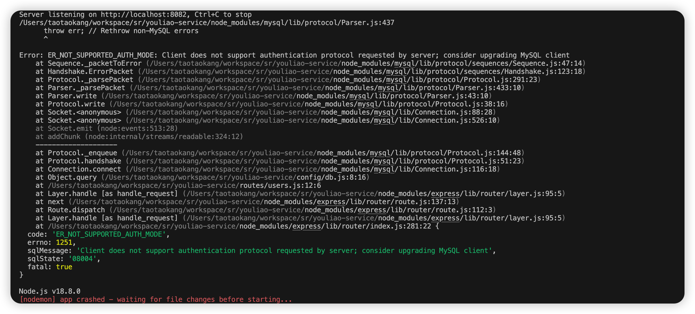
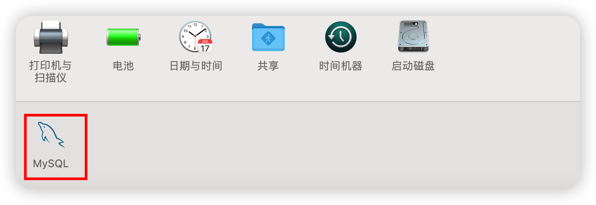
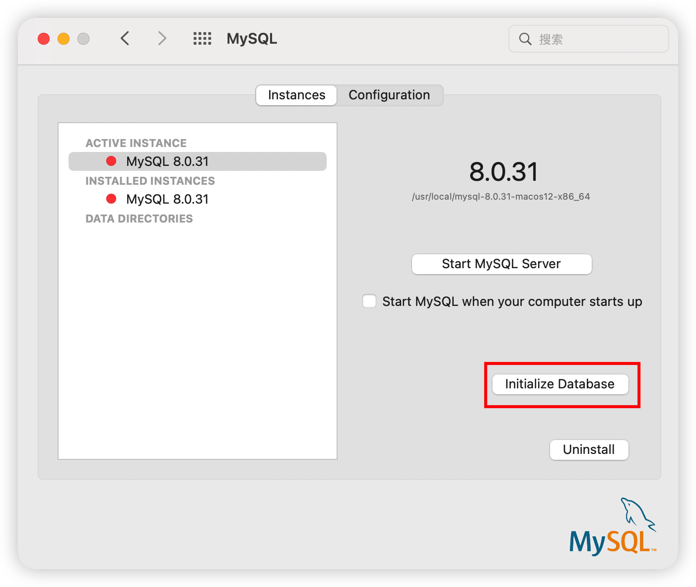
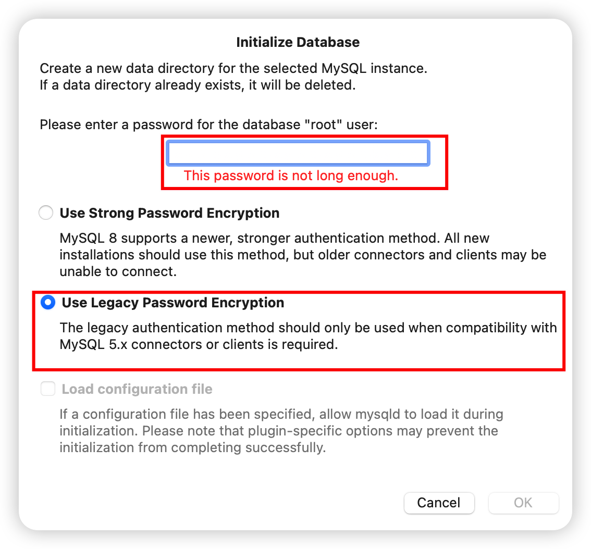

<!-----
lang: zh-CN
title: express
description: express使用收录
----->

### 下载安装 express。命令行语句

```sheel
npm i express-generator -g
```

出现 express 版本后表示安装成功。

### 创建 express 项目。命令行语句

```sheel
express 项目名称
```

### 进入项目根目录

```
cd 项目名称
```

### 端口设置

在 app.js 中，将下面代码放在`module.exports = app;`上面。

```js
const port = 8082; // 端口号可以随意设置，只要不冲突就行
app.listen(port, () => {
  console.log(`Server listening on http://localhost:${port}, Ctrl+C to stop`);
});
```

### 启动项目

```
npm install

npm start
```

从浏览器打开 localhost:上面的端口号 8082 访问

### 自动重启

因为每次修改都需要重新启动，比较麻烦，这里有个插件 nodemon，可以自动重启

```
npm install nodemon
```

将 package.json 文件中的代码修改为：

```
"start": "nodemon ./bin/www"
```

### 连接 MySQL 数据库

先安装 mysql

```
npm install mysql
```

然后封装数据库连接模块，在根目录下新建一个 utils 文件夹, 新建一个 db.config.js，与 db.js 内容如下:

```js
// db.config.js
// 创建mysql连接
module.exports = {
  host: "localhost", // 服务器地址
  user: "*****", // mysql用户名称
  password: "**********", // mysql用户密码
  port: "3306", // 端口
  database: "onepiece", // 数据库名称
};
```

```js
// db.js
const mysql = require("mysql");
const dbConfig = require("./db.config");

module.exports = (sql, params) => {
  return new Promise((resolve, reject) => {
    //每次使用的时候需要创建链接，数据操作完成之后要关闭连接
    const connection = mysql.createConnection(dbConfig);
    connection.connect((err) => {
      if (err) {
        reject(err);
      }
      //开始数据操作
      connection.query(sql, params, (err, results, fields) => {
        if (err) {
          reject(err);
        }

        //停止链接数据库，必须在查询语句后，要不然一调用这个方法，就直接停止链接，数据操作就会失败
        connection.end((err) => {
          if (err) {
            console.log("关闭数据库连接失败！");
            reject(err);
          }
        });

        //将查询出来的数据返回给回调函数
        resolve({
          results: results,
          fields: fields,
        });
      });
    });
  });
};
```

然后可以在 routes 目录下的文件中使用：

```js
const dbConnect = require("../utils/db");

router.get("/userList", async (req, res, next) => {
  try {
    const { results } = await dbConnect("SELECT * FROM sys_user");
    res.send({ results });
  } catch (error) {
    res.send({ msg: msg.serviceError, code: 500 });
  }
});
```

打开浏览器访问 http://localhost:8082/users/userList

### 问题

##### 问题描述：Mac 使用 Navicat 客户端连接 Mysql 报错：Client does not support authentication protocol requested by server; consider upgrading MySQL client



##### 解决方案：

1. 在系统偏好设置找到 Mysql



2. 停掉 Mysql 服务，点击进入"initialize dadabase"页面



3. 选择第二项然后输入 Mysql 新密码，点击"ok"



4. 重新启动 Mysql 服务

5. 使用 Navicat 客户端重新连接即可连接成功

### 使用 token

安装 jsonwebtoken 来完成 token 的生成和验证

```
npm install jsonwebtoken
```

在 utils 文件夹下, 新建一个 token.js 内容如下:

```js
const jwt = require("jsonwebtoken");

// 加密时候混淆
const secret = "123bingjsonjffjjf";

module.exports = {
  // 生成token
  // payload是需要存入token的信息
  createToken: (payload) => {
    const token = jwt.sign(payload, secret, {
      // token 有效时间 单位：s
      expiresIn: 60 * 60 * 10,
    });
    return token;
  },
  // 验证token
  verifyToken: (token) => {
    return new Promise((resolve, reject) => {
      jwt.verify(token, secret, (error, result) => {
        if (error) {
          reject(error);
        }
        resolve(result);
      });
    });
  },
};
```

使用，在 app.js 中，引用

```js
const token = require("./utils/token");
// 白名单
const whiteList = ["/users/signin"];

// token 校验
app.use(async (req, res, next) => {
  const authorization = req.headers.authorization?.replace("Bearer ", "");
  if (whiteList.includes(req.url)) {
    next();
  } else {
    try {
      const tokenData = await token.verifyToken(authorization);
      req.tokenData = tokenData;
      next();
    } catch (error) {
      res.status(401).send("invalid token");
    }
  }
});
```

### 设置允许跨域

```js
// app.js
// 设置允许跨域
app.use((req, res, next) => {
  //指定允许其他域名访问 *所有
  res.setHeader("Access-Control-Allow-Origin", "*");

  //允许客户端请求头中带有的
  res.setHeader(
    "Access-Control-Allow-Headers",
    "Content-Type,Content-Length, Authorization, Accept,X-Requested-With"
  );

  //允许请求的类型
  res.setHeader("Access-Control-Allow-Methods", "PUT,POST,GET,DELETE,OPTIONS");
  res.setHeader("X-Powered-By", " 3.2.1");

  // 让options请求快速返回
  if (req.method == "OPTIONS") {
    res.send(200);
  } else {
    next();
  }
});
```

### post 方式获取前端参数

安装 body-parser

```
npm install body-parser --save
```

在项目 app.js 中,引用和设置该模块

```js
const bodyParser = require("body-parser");

// 解析以 application/json 和 application/x-www-form-urlencoded 提交的数据
app.use(bodyParser.json());
app.use(bodyParser.urlencoded({ extended: false }));
```

routes 使用

```js
router.post("/xxx", (req, res, next) => {
  console.log("req token", req.tokenData);
  console.log("req body", req.body);
});
```

### 生成在线 API 接口文档

安装插件

```
npm install apidoc -g
```

配置文件，在根目录`package.json`文件，配置如下：

```json
"apidoc": {
  "name": "test接口文档",
  "title": "test接口文档",
  "description": "test接口文档说明",
  "url": "http://localhost:8111",
  "version": "1.0.0"
}
```

如果要生成文档，直接运行`apidoc -i routes/ -o public/apidoc/`

routes/是要生成文档的目录

public/apidoc/生成文档后存放的目录

为了方便，重启服务即生成文档，所以下面修改一下 package.json，改一下运行脚本

```
apidoc -i routes/ -o public/apidoc/ && cross-env NODE_ENV=development nodemon index.js --watch ./
```

有了这些配置后，对接口增加注释，即可生成文档

接口上方的注释部分就是 apidoc 的注解部分，信息解释：

```js
（1）@api {post} /api/user/info 用户信息
{post/get}请求方式；/api/user/info 接口地址；接口名字
（2）@apiName 接口名字
（3）@apiGroup 接口分组
（4）@apiDescription 描述
（5）@apiParam 请求参数
（6）@apiParamExample 请求参数示例
（7）@apiSuccess 响应数据
（8）@apiSuccessExample 响应数据示例
```

### 生成唯一标识符 ID

首先安装 node-uuid

```
npm install node-uuid
```

在需要使用的页面引入 node-uuid，生成 uuid

```js
const uuid = require("node-uuid");

const useridd = uuid.v1(); //  以时间戳为基础的
console.log(useridd); //   610fb180-e6bc-11ea-862c-e779aadb8c20
const useridd = uuid.v4(); //  随机的，可能会有重复的哦
console.log(useridd); //   2ec59400-ad82-4cf5-93c9-d1fb01f40301
```

### 加解密

安装

```
npm install crypto
```

```js
var crypto = require("crypto"); //引入crypto模块
var md5 = crypto.createHash("md5");
var message = "hello";
var digest = md5.update(message, "utf8").digest("hex"); //hex转化为十六进制
console.log(digest);
// 输出如下：注意这里是16进制
// 5d41402abc4b2a76b9719d911017c592
```

### 生成随机用户头像

安装

```
npm install crypto
```

```js
let imgData = new identicon("hello");
let imgUrl = "data:/image/png;base64," + imgData;
```
